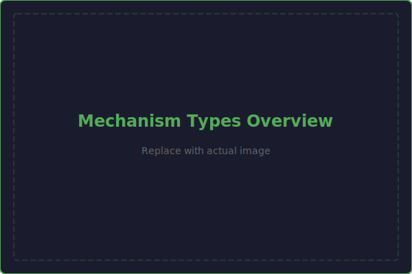

# Mechanisms

This page provides an overview of the common mechanism types used in FRC robots. Each mechanism type includes a description, design considerations, and guidance on when to use it.

---

## Intakes

Intakes acquire game pieces from the field and bring them into the robot.

### Roller Intake
Powered rollers (compliant wheels, flex wheels, or surgical tubing) that grip game pieces through friction.

- **Best for:** Balls, discs, foam game pieces
- **Pros:** Fast acquisition, works at speed, reliable
- **Cons:** Requires tuning compression and roller speed

### Slapdown / Over-the-Bumper Intake
A pivoting intake arm that deploys over the bumper to reach game pieces at ground level.

- **Best for:** Ground pickup when bumpers are in the way
- **Pros:** Can reach past bumpers, fast deployment
- **Cons:** More complex (deploy mechanism), extends outside frame perimeter
- **Detailed coverage:** [V5 Foundation — Intakes](../../foundation/unit4/intakes.md)

### Pneumatic Intake
Uses a pneumatic cylinder to open/close a claw or gripper around a game piece.

- **Best for:** Larger game pieces, cones, cubes with flat surfaces
- **Pros:** Simple (open/close), strong grip, fast
- **Cons:** Binary control (open or closed), requires pneumatic system

### Passive Intake
Uses geometry (funnels, ramps, guides) rather than powered mechanisms to capture game pieces.

- **Best for:** Game pieces that can be guided by bumpers or static features
- **Pros:** Zero weight, zero complexity, zero failure modes
- **Cons:** Very limited capability, game-specific

---

## Shooters

Shooters launch game pieces at speed toward scoring goals.

### Flywheel Shooter
Spinning wheels accelerate game pieces through friction.

- **Best for:** Balls, discs that need to travel across the field
- **Pros:** Variable speed, consistent shots, rapid fire
- **Cons:** Spin-up time, compression tuning required
- **Detailed coverage:** [V5 Foundation — Wedge and Pushing](../../foundation/unit4/wedge-and-pushing.md)

### Catapult / Puncher
A spring-loaded or pneumatic arm that strikes the game piece.

- **Best for:** Heavy game pieces, short-range scoring
- **Pros:** Simple, powerful, consistent
- **Cons:** Slow cycle time, limited range adjustment

---

## Elevators

Elevators provide vertical linear motion for lifting game pieces or mechanisms.

### Cascade Elevator
Multiple nested stages extend simultaneously through rigging.

- **Best for:** Long vertical travel, smooth motion
- **Pros:** Large range, fast (speed multiplied by stages), compact when retracted
- **Cons:** Complex rigging, requires counterbalancing
- **Detailed coverage:** [V5 Foundation — Linear Slider](../../foundation/unit4/linear-slider.md)

### Continuous Elevator
Stages extend sequentially (first stage fully extends before second begins).

- **Best for:** Applications where speed multiplication isn't needed
- **Pros:** Simpler rigging than cascade
- **Cons:** Slower than cascade for the same total travel

### Screw-Driven Lift
A lead screw converts rotational motion to linear motion.

- **Best for:** Slow, high-force lifting with precise positioning
- **Pros:** Very strong, self-locking (won't back-drive), precise
- **Cons:** Slow, heavy, efficiency losses

---

## Arms

Arms provide rotational motion around a pivot point.

### Single-Joint Arm
A single pivot point with a rigid arm extending to an end effector.

- **Best for:** Simple scoring at different heights
- **Pros:** Simple, reliable, easy to control
- **Cons:** Limited reach envelope, heavy for long arms
- **Detailed coverage:** [V5 Foundation — Intakes](../../foundation/unit4/intakes.md) and [Wedge and Pushing](../../foundation/unit4/wedge-and-pushing.md)

### Double-Jointed Arm
Two linked arm segments with independent pivots.

- **Best for:** Large reach envelope, reaching over obstacles
- **Pros:** Huge reach, can reach around things
- **Cons:** Complex control, heavy, requires careful counterbalancing

### Virtual Four-Bar
A mechanism that uses a four-bar linkage to keep the end effector at a constant angle as the arm rotates.

- **Best for:** Keeping a gripper level as the arm moves
- **Pros:** Passive angle control (no extra motor needed)
- **Cons:** Added complexity and weight in the linkage

---

## Climbers

Climbers allow the robot to lift itself off the ground during the endgame.

### Hook and Winch
A hook grabs a bar, and a winch (motorized spool) reels in cable to lift the robot.

- **Best for:** Simple climbing on horizontal bars
- **Pros:** Simple, lightweight, reliable
- **Cons:** Single height only, needs alignment

### Elevator Climber
The robot's elevator mechanism doubles as a climber by attaching a hook to the carriage.

- **Best for:** Robots that already have an elevator
- **Pros:** Dual-purpose mechanism saves weight
- **Cons:** Must be designed into the elevator from the start

### Telescoping Climber
A telescoping tube assembly that extends upward and hooks onto a bar, then retracts to lift the robot.

- **Best for:** High climbing targets
- **Pros:** Compact when retracted, long reach
- **Cons:** Heavy, complex extension mechanism

---

## Choosing a Mechanism

When deciding which mechanism type to use, consider:

| Factor | Questions to Ask |
|--------|-----------------|
| **Game piece** | What size, shape, weight, and material? |
| **Task** | Ground pickup? High scoring? Launching? Lifting? |
| **Speed** | How fast does the cycle need to be? |
| **Reach** | How far/high does the mechanism need to reach? |
| **Weight** | What's the weight budget for this mechanism? |
| **Complexity** | Can your team build and maintain this? |
| **Reliability** | What happens if it breaks at competition? |

!!! tip "The Best Mechanism is the Simplest One That Works"
    Always start with the simplest option that meets your requirements. A simple mechanism that works every time is worth more than a complex mechanism that fails occasionally. You can always add complexity later if needed — it's much harder to simplify after the fact.
