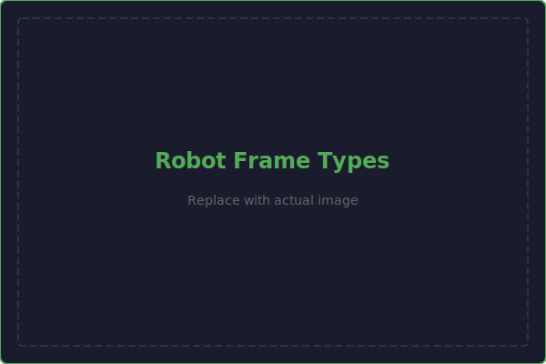

# Robot Structure

The structure of your robot is the foundation that everything else mounts to. A well-designed structure is rigid, lightweight, and easy to manufacture. This page covers the key concepts of FRC robot structural design.

---

## Frame Types

### Box Tube Frame
The most common FRC frame type. The perimeter and internal structure are built from rectangular aluminum tube.

- **Material:** 6061-T6 aluminum
- **Common sizes:** 1"x1", 1"x2", 2"x2"
- **Wall thickness:** 1/16" (0.0625") for light structures, 1/8" (0.125") for heavy-duty
- **Joining:** Gussets with rivets or bolts
- **Pros:** Simple, strong, lightweight, easy to cut and drill
- **Cons:** Requires gussets at joints, limited to straight runs

### Extrusion Frame
Uses aluminum extrusion profiles (like 80/20 or similar) with T-slot connections.

- **Pros:** Easy to assemble and reconfigure, no welding needed
- **Cons:** Heavier than tube for equivalent strength, expensive

### Plate Frame
Uses machined or laser-cut aluminum plates as the primary structure.

- **Pros:** Can integrate complex features (bearing pockets, motor mounts) into the structure itself
- **Cons:** Expensive to manufacture, harder to modify

!!! tip "Box Tube is the Default"
    Unless you have a specific reason to use something else, build your frame from **1"x2" box tube with 1/16" wall**. It's the best combination of strength, weight, cost, and manufacturability for FRC. Most top teams use this approach.

---

## Materials

### Aluminum 6061-T6
The standard material for FRC robot structure.

| Property | Value |
|----------|-------|
| Density | 0.098 lb/in³ |
| Yield Strength | 40,000 psi |
| Elastic Modulus | 10,000,000 psi |
| Machinability | Excellent |
| Cost | Low-moderate |

### Aluminum 7075-T6
Stronger than 6061 but harder to machine and more expensive. Used for high-stress components.

| Property | Value |
|----------|-------|
| Density | 0.101 lb/in³ |
| Yield Strength | 73,000 psi |
| Elastic Modulus | 10,400,000 psi |

### Polycarbonate (Lexan)
Transparent plastic used for guards, shields, and light structural elements.

| Property | Value |
|----------|-------|
| Density | 0.043 lb/in³ |
| Yield Strength | 9,000 psi |
| Impact Resistance | Very high |

### Steel
Rarely used for structure (too heavy), but essential for shafts and gears.

| Property | Value |
|----------|-------|
| Density | 0.284 lb/in³ |
| Yield Strength | 36,000-120,000 psi (varies by alloy) |

---

## Joining Methods

### Rivets
The **default fastener** for FRC structural joints.

- Pop rivets (blind rivets) in 3/16" diameter are standard
- Fast to install with a rivet gun
- Permanent connection (must be drilled out to remove)
- Excellent shear strength
- Use with gussets at tube joints

### Bolts
Used where disassembly is needed or for high-load connections.

- **#10-32** — Standard for most FRC applications (motor mounts, bearing blocks, general purpose)
- **1/4-20** — For higher-load applications
- **#8-32** — For lighter applications and electronics
- Always use lock nuts (Nyloc) to prevent loosening from vibration

### Welding
Provides the strongest joints but requires equipment and skill.

- TIG welding is preferred for aluminum
- Not all teams have welding capability
- Welds are permanent — can't be adjusted or disassembled

---

## Structural Concepts

### Box Construction
A frame with a bellypan (bottom plate) riveted to the perimeter tubes creates a **box structure** that is dramatically stiffer than the tubes alone. The bellypan acts as a shear panel, resisting twisting and racking.

!!! warning "Always Use a Bellypan"
    A frame without a bellypan is flexible and will twist under load. The bellypan is one of the lightest structural additions you can make, and it dramatically improves rigidity. Even 1/16" aluminum is sufficient.

### Triangulation
Rectangular frames are inherently flexible — they can parallelogram. Adding **diagonal bracing** (either tubes or gussets) creates triangles that resist this deformation.

### Gusseting
Gussets are **triangular plates** riveted to both sides of a tube joint. They transfer loads between tubes and prevent the joint from rotating.

- Use gussets at every tube joint
- Standard gusset material: 1/8" aluminum plate
- Gussets should extend at least 2 rivet diameters from the joint on each tube

---

## Common Bolt Sizes for FRC

| Bolt Size | Common Uses | Drill Size | Clearance Hole |
|-----------|------------|-----------|----------------|
| #8-32 | Electronics, light brackets | #29 (0.136") | #18 (0.170") |
| #10-32 | General purpose, motor mounts | #21 (0.159") | #10 (0.196") |
| 1/4-20 | High-load connections | #7 (0.201") | F (0.257") |
| 3/8-16 | Axle bolts, bumper mounts | 5/16" (0.313") | 13/32" (0.406") |

---

## Bumper Mounting

FRC rules require bumpers on the robot perimeter. Bumpers must be:

- Removable (for inspection and repairs)
- Securely attached (won't fall off during a match)
- At the correct height (typically 3" to 7.5" above ground)

Common mounting methods:

- **Angle brackets** bolted to the frame with wing nuts for quick removal
- **Bumper pins** (quick-release pins through brackets)
- **Hook-and-loop** (Velcro) combined with mechanical retention

!!! note "Design Bumper Mounts Early"
    Bumper mounting is often an afterthought, but it affects the frame design. Plan your bumper mounting method during the frame design phase, not after the robot is built.
