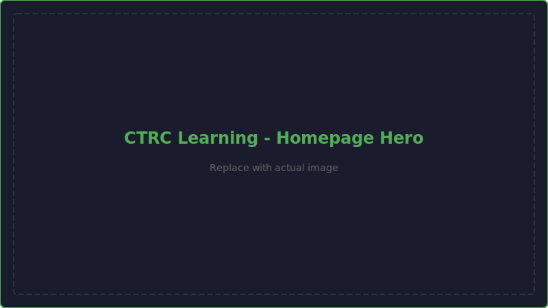

# Welcome to CTRC Learning

Welcome to the **Caution Tape Robotics Club Learning Hub** — your hands-on guide to building, coding, and competing with VEX V5 robots.

Whether you're picking up a wrench for the first time or already know your way around a drivetrain, this site takes you from zero to competition-ready. Every module follows our **Learn It → Build It → Prove It** philosophy — learn the concept, build it on your robot, then hit the field and prove it works.

---

## What You'll Find Here

-   :material-school:{ .lg .middle } **V5 Foundation Program**

    ---

    A structured, hands-on curriculum from CAD basics to advanced robot design. Unit-based exercises and real-world projects.

    [:octicons-arrow-right-24: Start Learning](foundation/index.md)

-   :material-rocket-launch:{ .lg .middle } **Projects**

    ---

    Applied project tracks beyond V5. Build a BattleBot from scratch — CAD it, print it, wire it, fight it.

    [:octicons-arrow-right-24: View Projects](projects/index.md)

-   :material-book-open-variant:{ .lg .middle } **Design Handbook**

    ---

    Reference guide covering VEX design principles — structure, power transmission, and mechanism types.

    [:octicons-arrow-right-24: Browse Handbook](design-handbook/index.md)

-   :material-cog:{ .lg .middle } **Mechanism Examples**

    ---

    Curated gallery of real VEX mechanism designs organized by type. Study how top teams build.

    [:octicons-arrow-right-24: View Examples](mechanism-examples/index.md)

-   :material-link-variant:{ .lg .middle } **Resources**

    ---

    External links to Onshape tutorials, VEX community resources, supplier catalogs, and calculators.

    [:octicons-arrow-right-24: Find Resources](resources/index.md)

-   :material-human-male-board:{ .lg .middle } **Educator's Guide**

    ---

    Lesson plans, pacing guides, and assessment rubrics for mentors and coaches running a VEX V5 robotics program.

    [:octicons-arrow-right-24: Educator's Guide](educators-guide/index.md)

---

## Getting Started

If you're **brand new**, start here:

1. Read the [Website Feature Guide](website-feature-guide.md) to learn how to navigate this site
2. Head to the [V5 Foundation Program](foundation/index.md) and start with Unit 1
3. Work through each unit — build, code, design, then compete

If you **already have VEX experience**, jump to:

- [Unit 3](foundation/unit3/index.md) for Onshape CAD with V5 parts
- [Unit 4](foundation/unit4/index.md) for mechanism design (intakes, sliders, wedges)
- [BattleBots](projects/battlebots/index.md) if you want to build a combat robot

---

## About CTRC

The Caution Tape Robotics Club is dedicated to helping students learn robotics through building, coding, and competing. This learning site is a community resource — built by mentors and students, for students.

!!! tip "Join the Community"
    Have questions? Want to share your progress? Connect with other learners and mentors through our club channels. Robotics is always better with friends.

!!! note "This Site is a Living Document"
    Content is continuously updated and improved. If you find errors or have suggestions, check out the [Contribution Guide](contribution/index.md).
