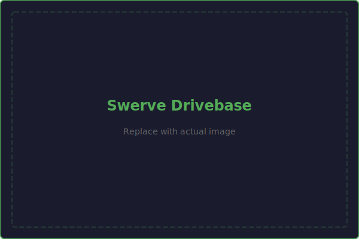
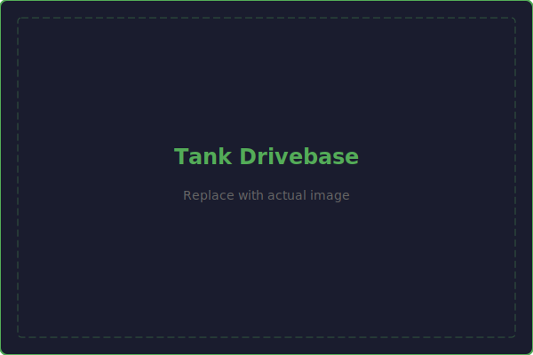
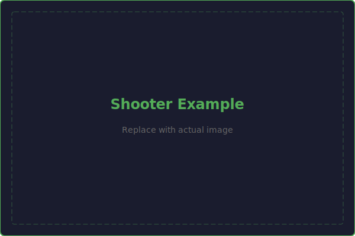
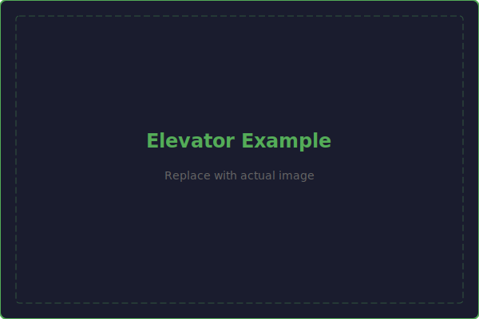
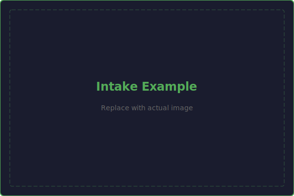
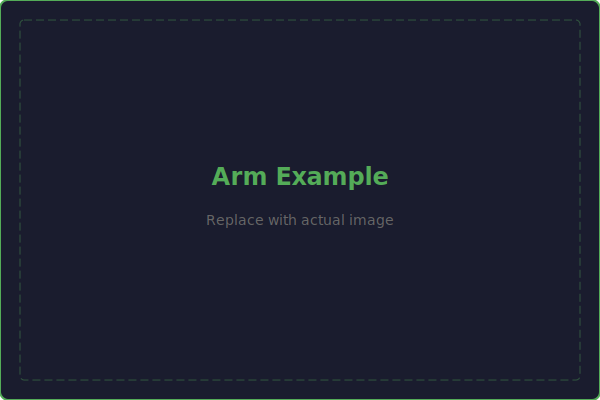

# Mechanism Examples

This gallery showcases real-world VEX mechanism designs organized by type. Study these examples to understand how top teams approach common design challenges. Each example includes a description of the design decisions and key features.

!!! tip "Learn by Studying"
    One of the fastest ways to improve as a designer is to study what others have built. Look at the structural design, power transmission choices, material selection, and packaging. Ask yourself: "Why did they make that choice?"

---

## Drivebases

## Mechanisms

---

## Intakes

### Over-the-Bumper Roller Intake
**Common approach for ground game piece acquisition.**

Key features typically seen in top designs:

- **Compliant wheels** (2-3 inch) on hex shafts for game piece grip
- **Spring-loaded deployment** with motor-controlled retraction
- **Polycarbonate or thin aluminum** side plates to minimize weight
- Power transmission through **belt or chain** from a NEO 550
- **Hard stops** at both deployed and retracted positions
- **Surgical tubing** or flex wheels for enhanced grip on certain game pieces

### Funnel/Passive Intake
**Used when game pieces can be guided without active mechanisms.**

Key features:

- Carefully shaped **polycarbonate funnels** that guide game pieces
- **Compliant bumper covers** that help center game pieces on contact
- Geometry designed around the specific game piece dimensions
- Often combined with an active roller at the throat of the funnel

---

## Shooters

### Single-Flywheel Shooter
**The most common shooter configuration in VEX.**

Key design elements:

- **4-inch Colson or compliant wheels** as the flywheel
- **Curved polycarbonate hood** with adjustable exit angle
- **Two NEO motors** on the flywheel shaft for fast spin-up and recovery
- **Direct drive or 1:1 belt** from motors to flywheel
- Compression set by the gap between flywheel and hood
- **Side plates** thick enough to support the flywheel shaft without deflection

### Dual-Flywheel Shooter
**Used when spin control is critical.**

Key design elements:

- Independent top and bottom flywheels with separate motors
- **Differential speed** between top and bottom controls backspin/topspin
- More consistent shots at varying distances
- Typically heavier and more complex than single-flywheel

---

## Elevators

### Two-Stage Cascade Elevator
**The standard vertical lift in VEX.**

Key design elements:

- **1"x2" box tube** rails for each stage
- **V-groove bearings** riding on tube edges for smooth sliding
- **Cascade rigging** with Dyneema or spectra rope
- **Counterbalance** using constant-force springs or gas springs
- **Cross bracing** between rails for torsional rigidity
- Belt or cable spool drive from NEO motor with 10:1-20:1 gearbox

### Three-Stage Cascade Elevator
**For extra-long vertical reach.**

Key design elements:

- Same principles as two-stage but with an additional nesting stage
- Requires careful attention to **stage overlap** at full extension
- **More counterbalancing** needed due to greater height and weight
- **Wider base** stage to accommodate nested stages

---

## Arms

### Dead Axle Arm Pivot
**The preferred arm pivot design for high-load applications.**

Key design elements:

- **1" round dead axle** shaft fixed to the frame
- Arm rotates on **bearings** around the dead axle
- Torque transmitted through a **large sprocket** (48-60T) bolted to the arm hub
- **#25 chain** or belt from a MAXPlanetary gearbox (100:1+ ratio)
- **Both-end shaft support** with thick (0.25") tower plates
- **Gas spring counterbalance** to reduce motor load

### Double-Jointed Arm
**For maximum reach envelope.**

Key design elements:

- Two arm segments with independent pivot points
- Careful **counterbalancing** at each joint
- **Cable/chain routing** that doesn't interfere with arm motion
- Software-controlled coordinated joint movement
- Significant structural reinforcement at each pivot

---

## Drivetrains

### Swerve Drive
**The dominant drivetrain in modern competitive VEX.**

Key design elements:

- **Four swerve modules** (SDS MK4i, REV MAXSwerve, WCP SwerveX, etc.)
- **28"x28"** or similar square frame
- Modules **inset 2.5-3 inches** from frame corners for bumper clearance
- **Bellypan** riveted to frame rails for rigidity
- **Battery centered** for balance
- Electronics packaged around the center of the robot

### West Coast Drive (Tank Drive)
**A simpler, proven drivetrain option.**

Key design elements:

- **6 wheel drop-center** (center wheel slightly lower for turning)
- **Direct-driven center wheel** with outer wheels connected by chain or belt
- Integrated gearbox in the frame rail
- Single-speed typically 5:1 to 8:1

---

## Climbers

### Hook and Winch Climber
**Simple and reliable.**

Key design elements:

- **Deployable hook** (pneumatic or motorized) that reaches up to a bar
- **Winch drum** driven by a high-torque motor (NEO with 50:1+ gearbox)
- **Dyneema or steel cable** wound on the drum
- **Ratchet mechanism** to prevent back-driving
- Compact packaging, often mounted on the back of the robot

---

## How to Study These Examples

When looking at a mechanism example, ask yourself:

1. **What problem does this solve?** — What game task does this mechanism accomplish?
2. **Why this approach?** — What alternatives exist, and why was this one chosen?
3. **What makes it work well?** — What specific design features contribute to its effectiveness?
4. **What are the tradeoffs?** — What did the team give up by choosing this approach?
5. **How would I improve it?** — What would you change if you were designing a similar mechanism?

!!! note "Find More Examples"
    The best sources for VEX mechanism examples are:

    - **VEX Forum** — Robot showcase threads
    - **RobotEvents** — Match videos and event results
    - **Team reveals** — Teams that share their design process publicly
    - **Team CAD releases** — Many top teams publish their Onshape documents after the season
