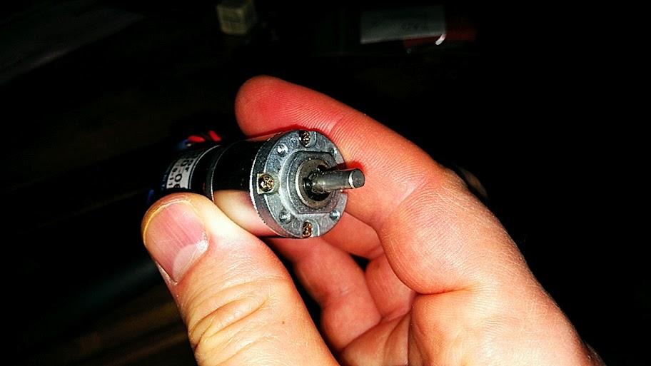

# BattleBots Curriculum - 5-Agent Parallel Execution Plan

**Date:** March 12, 2026
**Objective:** Complete visual asset integration and quality improvements using coordinated agent teams
**Estimated Total Time:** 8-12 hours (parallel execution)

---

## Team Structure

### Agent 1: Content Audit & Fix
**Focus:** Structural improvements, navigation fixes, content consistency
**Skillset:** Markdown editing, content strategy, information architecture
**Output:** Updated module files with fixes, improved navigation

### Agent 2: Visual Asset Quality Control
**Focus:** Image sourcing, optimization, integration, alt text
**Skillset:** Image research, file management, accessibility standards
**Output:** Complete image library with proper attribution and optimization

### Agent 3: Attribution & Licensing
**Focus:** Source verification, legal compliance, documentation
**Skillset:** License interpretation, attribution standards, documentation
**Output:** Comprehensive attribution system, consolidated documentation

### Agent 4: Student Experience Testing
**Focus:** Workflow validation, usability improvements, handoff clarity
**Skillset:** UX design, educational best practices, student perspective
**Output:** Enhanced module structure, checkpoint pages, success criteria

### Agent 5: Documentation & Maintenance
**Focus:** Style guides, contributor guidelines, future-proofing
**Skillset:** Technical writing, standards documentation, process design
**Output:** Maintainer resources, quality standards, troubleshooting guides

---

## Agent 1: Content Audit & Fix

### Mission
Fix all structural issues, navigation inconsistencies, and content gaps identified in audit.

### Specific Tasks

#### Task 1.1: Navigation Fixes (CRITICAL)
**Estimated Time:** 30 minutes

**Actions:**
1. Edit `index.md`:
   - Remove phases 7-9 from phase table (teacher modules)
   - Add note after phase 7: "Your teacher will complete electronics, wiring, and safety testing"
   - Update total time estimate to 13-18 hours (student-only phases)

2. Verify `mkdocs.yml`:
   - Confirm teacher modules remain commented out
   - Test navigation after changes

**Files Modified:**
- `/docs/projects/battlebots/index.md`

**Success Criteria:**
- [ ] Student phase table shows only phases 1-7
- [ ] Clear handoff message after mechanical assembly
- [ ] Navigation doesn't reference hidden modules

---

#### Task 1.2: Add Path Markers to All Modules
**Estimated Time:** 45 minutes

**Actions:**
Add role marker admonition to top of each module (after title, before content):

**Student Modules (7 files):**
```markdown
!!! info "Student Module"
    This module is completed by you. Ask your teacher if you have questions, but the work is yours.
```

**Teacher Modules (2 files):**
```markdown
!!! warning "Teacher Module"
    This module is completed by teachers/mentors. Students will receive a completed, safety-tested robot after this phase.
```

**Files Modified:**
- All 9 module files

**Success Criteria:**
- [ ] Every module has clear role marker at top
- [ ] Student modules use "info" admonition
- [ ] Teacher modules use "warning" admonition

---

#### Task 1.3: Add Alt Text to All Existing Images
**Estimated Time:** 1 hour

**Actions:**
For each of the 10 existing images, replace generic alt text with descriptive alt text:

**Current Format:**
```markdown

```

**Improved Format:**
```markdown

```

**Guidelines:**
- Describe what's happening in the image
- Include relevant technical details
- 15-25 words optimal
- Mention tools/parts visible
- Note orientation or perspective if relevant

**Files Modified:**
- `3d-printing-guide.md` (1 image)
- `assembly-and-wiring.md` (8 images)
- `cad-your-bot.md` (1 image - when integrated)

**Success Criteria:**
- [ ] All 10 images have descriptive alt text
- [ ] Alt text includes action/context
- [ ] Blind reader would understand image purpose

---

#### Task 1.4: Fix Inconsistent File Naming
**Estimated Time:** 15 minutes

**Actions:**
1. Rename CAD screenshot to remove timestamp:
   ```
   Before: onshape-mass-properties-overview-2026-03-12T23-37-24-035Z.png
   After:  onshape-mass-properties-weapon.png
   ```

2. Create second copy for assembly usage:
   ```
   onshape-mass-properties-assembly.png
   ```

3. Update any references (if screenshot is integrated by Agent 2)

**Files Modified:**
- `/docs/projects/battlebots/images/cad/` (rename/copy file)
- Module files (if references exist)

**Success Criteria:**
- [ ] No timestamps in filenames
- [ ] Descriptive names that indicate content
- [ ] Consistent with existing naming pattern

---

#### Task 1.5: Create Markdown Lint Standards
**Estimated Time:** 30 minutes

**Actions:**
1. Document markdown standards in QUALITY_STANDARDS.md:
   - Heading hierarchy (no skipped levels)
   - List formatting (consistent bullets)
   - Table formatting (aligned pipes)
   - Code block language tags
   - Admonition types and usage

2. Run through all module files and fix violations

**Files Modified:**
- All module files (formatting fixes)
- `QUALITY_STANDARDS.md` (document standards)

**Success Criteria:**
- [ ] All modules follow same formatting rules
- [ ] No heading level skips (h1 → h2 → h3)
- [ ] Tables are readable in source markdown
- [ ] Code blocks have language tags

---

### Dependencies
- **Blocks:** Agent 2 (waits for image integration before adding alt text to new images)
- **Blocked by:** None (can start immediately)

### Deliverables
1. Updated `index.md` with correct student workflow
2. All modules with role markers
3. All existing images with descriptive alt text
4. Consistent file naming
5. Markdown formatting standards documented

---

## Agent 2: Visual Asset Quality Control

### Mission
Complete visual asset integration: source, optimize, integrate, and verify all images.

### Specific Tasks

#### Task 2.1: Source Robot Archetype Photos (CRITICAL - Tier 1)
**Estimated Time:** 2 hours

**Actions:**
1. **Drum Spinner:**
   - Source: Thingiverse thing:7001396 (AlexKorvin)
   - Download best photo showing drum weapon clearly
   - Verify CC license allows educational use
   - Save as: `drum-spinner-alexkorvin.jpg`

2. **Eggbeater/Beater Bar:**
   - Source: Repeat Robotics or Team Small Robots
   - Find clear photo of bar weapon
   - Save as: `eggbeater-bar-weapon.jpg`

3. **Vertical Disc Spinner:**
   - Source: Team Monsoon "Drizzle" or Instructables DIY project
   - Large disc clearly visible
   - Save as: `vertical-disc-drizzle.jpg`

4. **Horizontal Midcutter:**
   - Source: aaronbot3000 "Dinner Time" or Repeat Robotics
   - Horizontal blade at mid-height visible
   - Save as: `midcutter-horizontal-blade.jpg`

5. **Undercutter:**
   - Source: Thingiverse thing:5202939 (Lord_Toby)
   - Blade under chassis visible
   - Save as: `undercutter-low-blade.jpg`

**Directory:**
- `/docs/projects/battlebots/images/archetypes/`

**Integration:**
Edit `robot-archetypes.md`:
```markdown
### Drum Spinners

[existing text...]


*Drum spinner by AlexKorvin - demonstrates wide attack area and frontal armor*
```

**Files Modified:**
- `robot-archetypes.md` (integrate 5 photos)
- Create `/docs/projects/battlebots/images/archetypes/` directory

**Success Criteria:**
- [ ] All 5 archetype photos sourced and saved
- [ ] Images are high resolution (800px+ wide)
- [ ] All integrated into robot-archetypes.md with captions
- [ ] Each placeholder "!!! example" replaced with actual image

---

#### Task 2.2: Create CAD Workflow Screenshots (CRITICAL - Tier 1)
**Estimated Time:** 3 hours

**Actions:**
1. Open Onshape, create new document "CTRC-BattleBot-Reference"

2. **Screenshot 1: Bounding Box**
   - Create 6x6" rectangle sketch on Top plane
   - Name sketch "Bounding-Box"
   - Screenshot with feature tree visible
   - Save as: `cad-bounding-box-sketch.png`

3. **Screenshot 2: Chassis Sketch**
   - Sketch chassis outline with motor pockets, battery compartment
   - Include dimensions
   - Screenshot zoomed to show detail
   - Save as: `cad-chassis-sketch-pockets.png`

4. **Screenshot 3: Extruded Chassis**
   - Extrude chassis with internal ribs
   - 3D view, isometric angle
   - Screenshot showing hollowed interior
   - Save as: `cad-chassis-extruded-ribs.png`

5. **Screenshot 4: Weapon Mass Properties**
   - Use existing screenshot (rename from timestamp version)
   - Or create new weapon, show mass properties dialog
   - Center of mass visible on spin axis
   - Save as: `cad-weapon-mass-properties.png`

6. **Screenshot 5: Assembly Mass Properties**
   - Complete assembly with all parts
   - Mass properties dialog open
   - Total mass ~500g visible
   - Save as: `cad-assembly-mass-properties.png`

7. **Screenshot 6: Top View with Bounding Box**
   - Assembly in Top view
   - Bounding box sketch visible
   - Everything fits within 6x6"
   - Save as: `cad-assembly-top-view-bounds.png`

**Directory:**
- `/docs/projects/battlebots/images/cad/`

**Integration:**
Edit `cad-your-bot.md`:
- Replace each "!!! example '🖥️ Screenshot Needed'" with actual image
- Add descriptive captions
- Ensure images are referenced in correct step

**Files Modified:**
- `cad-your-bot.md` (integrate 5-6 screenshots)

**Success Criteria:**
- [ ] All CAD workflow steps have screenshots
- [ ] Onshape UI visible (students can replicate)
- [ ] Feature tree expanded showing part names
- [ ] All images are PNG format (sharp UI)
- [ ] Each screenshot shows exact step described in text

---

#### Task 2.3: Create Weapon Design Diagrams (Tier 3)
**Estimated Time:** 2 hours

**Actions:**
1. **Diagram 1: Mass Distribution Comparison**
   - Vector diagram (SVG) or high-quality PNG
   - Show 3 weapon shapes: solid disc, ring/shell, bar
   - Same total mass, different distributions
   - Arrows showing radius and mass concentration
   - Save as: `weapon-mass-distribution-comparison.svg`

2. **Diagram 2: Bite Calculation**
   - Show weapon tooth, opponent surface
   - Arrow showing forward travel distance (bite)
   - Labels: closing speed, RPM, tooth spacing
   - Formula callout
   - Save as: `weapon-bite-diagram.svg`

3. **Diagram 3: Balance Check (use existing screenshot)**
   - Onshape mass properties screenshot
   - Annotate: center of mass location, spin axis
   - Red circle highlighting alignment
   - Save as: `weapon-balance-check-annotated.png`

**Tools:**
- Figma (vector diagrams)
- or Adobe Illustrator
- or hand-drawn + scanned + cleaned

**Directory:**
- `/docs/projects/battlebots/images/weapon/`

**Integration:**
Edit `weapon-design.md`:
- Replace "!!! example '📐 Diagram Needed'" markers
- Add captions explaining what to observe

**Files Modified:**
- `weapon-design.md` (integrate 3 diagrams)

**Success Criteria:**
- [ ] All 3 physics concepts have visual diagrams
- [ ] Diagrams use limited color palette (3-4 colors)
- [ ] Labels are legible (14pt+ text)
- [ ] SVG format for scalability

---

#### Task 2.4: Source Safety & Hardware Photos (Tier 2)
**Estimated Time:** 2 hours

**Actions:**
1. **Weapon Lock Photo:**
   - Find reference photo of pin/clip weapon lock on combat robot
   - Or photograph CTRC robot with weapon lock installed
   - Save as: `safety-weapon-lock-installed.jpg`

2. **N20 Motor Photo:**
   - Product photo from supplier or photograph actual N20
   - D-shaft, gearbox, terminals visible
   - Save as: `motor-n20-300rpm-labeled.jpg`

3. **LiPo Safety Photos:**
   - Photo 1: LiPo in fireproof bag on charger
   - Photo 2: Side-by-side healthy vs puffy battery
   - Save as: `safety-lipo-charging-setup.jpg`, `safety-lipo-healthy-vs-puffy.jpg`

4. **TPU Weapon Hub:**
   - Photo of flexible TPU hub, set screw visible
   - Contrasted with rigid PLA hub if possible
   - Save as: `weapon-tpu-hub-flexible.jpg`

**Directories:**
- `/docs/projects/battlebots/images/safety/`
- `/docs/projects/battlebots/images/motor/`
- `/docs/projects/battlebots/images/weapon/`

**Integration:**
- `rules-and-overview.md` (weapon lock)
- `drivetrain-design.md` (N20 motor)
- `testing-and-safety.md` (LiPo photos)
- `weapon-design.md` (TPU hub)

**Files Modified:**
- 4 module files

**Success Criteria:**
- [ ] All safety-critical concepts have photos
- [ ] Photos are well-lit and in focus
- [ ] Critical details are visible (D-shaft flat, puffy battery swelling, etc.)

---

#### Task 2.5: Optimize All Images
**Estimated Time:** 1 hour

**Actions:**
1. Resize all images to max 1200px width (except CAD screenshots: 1600px)
2. Compress JPG images to 85% quality
3. Optimize PNG images (use pngquant or similar)
4. Verify no image exceeds 300 KB
5. Create `/docs/projects/battlebots/images/optimized/` working directory

**Tools:**
- ImageMagick (command line)
- or Squoosh.app (web-based)
- or Photoshop batch processing

**Files Modified:**
- All image files (optimized in place or replaced)

**Success Criteria:**
- [ ] No image larger than 300 KB
- [ ] Visual quality still excellent
- [ ] Dimensions appropriate for web viewing
- [ ] Total image directory under 5 MB

---

### Dependencies
- **Blocks:** Agent 1 (alt text), Agent 3 (attribution for new images)
- **Blocked by:** None (can start immediately)

### Deliverables
1. 5 robot archetype photos integrated
2. 5-6 CAD workflow screenshots integrated
3. 3 weapon design diagrams integrated
4. 4-5 safety/hardware photos integrated
5. All images optimized for web
6. Zero "Photo Needed" or "Diagram Needed" placeholders remaining

---

## Agent 3: Attribution & Licensing

### Mission
Ensure legal compliance, proper attribution, and consolidated documentation.

### Specific Tasks

#### Task 3.1: Verify Licenses for New Images
**Estimated Time:** 2 hours

**Actions:**
1. For each robot archetype source (5 total):
   - Visit source page (Thingiverse, Instructables, etc.)
   - Document exact license (CC BY-SA, CC BY-NC-SA, etc.)
   - Verify "educational use" is allowed
   - Screenshot license statement as proof
   - Note any attribution requirements (name format, link back, etc.)

2. Create verification table:
   ```markdown
   | Image | Source | License | Edu Use? | Attribution Required |
   |-------|--------|---------|----------|---------------------|
   | drum-spinner | Thing:7001396 | CC BY-SA 4.0 | ✅ Yes | Author + link |
   ```

**Files Created:**
- `LICENSE_VERIFICATION.md` (internal reference)

**Success Criteria:**
- [ ] Every new image has verified license
- [ ] All licenses permit educational use
- [ ] Attribution requirements documented

---

#### Task 3.2: Update Attribution.md
**Estimated Time:** 1 hour

**Actions:**
1. Add entries for all newly sourced images:
   - Robot archetype photos (5)
   - Safety photos (3-4)
   - Any other new photos

2. Use existing format from attribution.md:
   ```markdown
   ### [Image Name]
   **Source:** [Platform] - "[Title]"
   **Author:** [Name]
   **URL:** [Direct link]
   **License:** [License type]
   **Description:** [What it shows]
   **Usage:** Module X - [Purpose]
   ```

3. Organize by module for easy lookup

4. Add "Last Updated" date at top

**Files Modified:**
- `attribution.md`

**Success Criteria:**
- [ ] All images have attribution entries
- [ ] Format consistent with existing entries
- [ ] Direct URLs provided for verification
- [ ] License types clearly stated

---

#### Task 3.3: Add Inline Attribution to Captions
**Estimated Time:** 1 hour

**Actions:**
For images requiring attribution (CC-licensed community content):

**Current Caption:**
```markdown

*Descriptive caption*
```

**Improved Caption:**
```markdown

*Descriptive caption. Photo by [Author Name], licensed under CC BY-SA 4.0.*
```

Add inline attribution to:
- Robot archetype photos (5)
- Instructables assembly photos (8 - already have, verify)
- Any other CC-licensed content

**Files Modified:**
- Module files with CC-licensed images

**Success Criteria:**
- [ ] All CC-licensed images have inline attribution
- [ ] Attribution format consistent
- [ ] Links to author profiles included

---

#### Task 3.4: Consolidate Documentation Files
**Estimated Time:** 1.5 hours

**Actions:**
1. **Create new README.md** (teacher quick start):
   - Merge intro content from INTEGRATION_GUIDE.md
   - Add "How to use this curriculum" section
   - Add "Student workflow overview" section
   - Add "Where to find images" → link to attribution.md
   - Add "How to add content" → link to SOURCING_GUIDE.md

2. **Create new SOURCING_GUIDE.md**:
   - Merge IMAGE_SOURCES.md (where to find images)
   - Merge MANUAL_DOWNLOAD_CHECKLIST.md (download steps)
   - Merge INTEGRATION_GUIDE.md (how to add to modules)
   - Add "Quality Standards" section from QUALITY_STANDARDS.md

3. **Delete redundant files:**
   - IMAGE_SOURCES.md
   - INTEGRATION_GUIDE.md
   - SOURCING_SUMMARY.md
   - MANUAL_DOWNLOAD_CHECKLIST.md
   - DOWNLOAD_CHECKLIST.md
   - RESOURCE_ACQUISITION_REPORT.md (archive, don't delete)

4. **Keep:**
   - README.md (new)
   - ATTRIBUTION.md (legal requirement)
   - SOURCING_GUIDE.md (new, consolidated)
   - QUALITY_STANDARDS.md (maintained by Agent 5)

**Files Created:**
- `README.md`
- `SOURCING_GUIDE.md`

**Files Deleted:**
- 5 redundant documentation files

**Files Archived:**
- `archive/RESOURCE_ACQUISITION_REPORT.md`

**Success Criteria:**
- [ ] Only 4 documentation files remain (README, ATTRIBUTION, SOURCING_GUIDE, QUALITY_STANDARDS)
- [ ] No duplicate information across files
- [ ] Clear purpose for each file
- [ ] All links updated to new file locations

---

#### Task 3.5: Create Attribution Footer Template
**Estimated Time:** 30 minutes

**Actions:**
Create reusable Markdown snippet for module footers:

```markdown
---

## Image Credits

All images in this module are used under educational fair use or with permission. See [complete attribution](images/attribution.md) for sources and licenses.

**Specific attributions:**
- [Image 1 name]: [Author/Source] ([License])
- [Image 2 name]: [Author/Source] ([License])
```

Add to bottom of modules with CC-licensed images.

**Files Modified:**
- Modules with CC-licensed images (robot-archetypes, assembly, printing)

**Success Criteria:**
- [ ] Modules with CC content have attribution footer
- [ ] Footer links to full attribution.md
- [ ] Specific images listed with authors

---

### Dependencies
- **Blocks:** None
- **Blocked by:** Agent 2 (needs to know which images were sourced before documenting attribution)

### Deliverables
1. All licenses verified for new images
2. attribution.md updated with new entries
3. Inline attribution added to captions
4. Documentation files consolidated (7 → 4)
5. Attribution footers added to relevant modules

---

## Agent 4: Student Experience Testing

### Mission
Validate workflow from student perspective, add checkpoints, improve usability.

### Specific Tasks

#### Task 4.1: Create Checkpoint Handoff Pages
**Estimated Time:** 2 hours

**Actions:**
Create 3 new mini-modules:

**1. checkpoint-design-review.md**
```markdown
# Design Review Checkpoint

You've completed your CAD design. Before printing, you need a design review with a mentor.

## What Gets Reviewed

Your mentor will check:
- [Checklist of review items]

## How to Prepare

Before your review meeting:
- [Preparation steps]

## Common Issues Caught Here

[List of typical problems and how to fix them]

## What Happens Next

After approval:
- [Next steps]
If changes needed:
- [Iteration process]
```

**2. checkpoint-mechanical-complete.md**
```markdown
# Mechanical Assembly Complete

Your chassis is assembled. Time to hand off to your teacher for electronics.

## Final Mechanical Checklist

- [Verification items]

## What to Document

Take photos of:
- [List]

## What Your Teacher Will Add

[Explanation of electronics phase]

## Timeline to Competition

- [Expectations]
```

**3. checkpoint-ready-to-compete.md**
```markdown
# Ready to Fight

Your robot is complete and safety-tested. Here's what happens next.

## Pre-Fight Inspection

- [Checklist]

## Driver Controls Refresher

- [Control layout]

## Strategy Tips

- [Competition advice]

## After Your Fight

- [Repair expectations, iteration process]
```

**Files Created:**
- 3 checkpoint files

**Integration:**
Add links in navigation flow:
- After CAD module → link to design-review
- After assembly module → link to mechanical-complete
- After testing (teacher) → link to ready-to-compete

**Success Criteria:**
- [ ] All checkpoints clearly explain handoff process
- [ ] Student knows what happens next at each stage
- [ ] Expectations are set for timelines
- [ ] Clear criteria for moving forward

---

#### Task 4.2: Add Learning Objectives to All Modules
**Estimated Time:** 2 hours

**Actions:**
For each of 9 modules, add at top (after role marker):

```markdown
## What You'll Learn

By the end of this module, you will be able to:

- [ ] [Specific, measurable objective 1]
- [ ] [Specific, measurable objective 2]
- [ ] [Specific, measurable objective 3]
```

**Guidelines:**
- Use action verbs (design, calculate, identify, demonstrate)
- Make measurable (not "understand weapon physics" but "calculate kinetic energy given mass and RPM")
- 3-5 objectives per module

**Files Modified:**
- All 9 module files

**Success Criteria:**
- [ ] Every module has 3-5 learning objectives
- [ ] Objectives are measurable
- [ ] Objectives align with module content

---

#### Task 4.3: Add Success Criteria to All Modules
**Estimated Time:** 1.5 hours

**Actions:**
For each module, add at bottom (before "Next Step"):

```markdown
## How You Know You're Done

✅ **You can demonstrate:**
- [Specific outcome]
- [Specific outcome]

✅ **Your design/build has:**
- [Measurable quality]
- [Measurable quality]

✅ **You're ready when:**
- [Final check]
```

**Examples:**

For CAD module:
```markdown
✅ You can demonstrate:
- Mass properties check shows ~500g total weight
- Center of mass is low and centered
- Weapon is balanced (center of mass on spin axis)

✅ Your design has:
- All parts fit within 6" x 6" bounding box
- STL files exported for all printable parts
- Design review completed with mentor

✅ You're ready when:
- You can explain every design decision
- You know which parts are PLA+, TPU, PETG
- You have a backup plan if a part breaks
```

**Files Modified:**
- All 9 module files

**Success Criteria:**
- [ ] Every module has explicit success criteria
- [ ] Criteria are objective (not subjective)
- [ ] Student knows exactly when to move on

---

#### Task 4.4: Add "Common Mistakes" Callouts
**Estimated Time:** 2 hours

**Actions:**
Review each module, identify 2-3 common student errors, add callouts:

```markdown
!!! warning "Common Mistake: [Specific Error]"
    Students often [do incorrect thing].

    **Why it's wrong:** [Explanation]

    **How to avoid:** [Correct approach]

    **How to fix:** [If already done wrong]
```

**Research:**
- Review existing content for warnings
- Add from teacher experience (if available)
- Anticipate based on complexity

**Target:** 2-3 callouts per module minimum

**Files Modified:**
- All 9 module files

**Success Criteria:**
- [ ] Each module has 2-3 "Common Mistake" callouts
- [ ] Mistakes are specific (not generic)
- [ ] Fix procedures are actionable

---

#### Task 4.5: Create Quick Reference Cheat Sheet
**Estimated Time:** 1.5 hours

**Actions:**
Create `quick-reference.md` with:

**1. Key Specifications**
```markdown
## Robot Specs
- Max footprint: 6" x 6" (152mm x 152mm)
- Target weight: ~500g
- Allowed weapons: Vertical or horizontal spinners only
```

**2. Component Specs**
```markdown
## N20 Motor
- Voltage: 3V
- Speed: 300 RPM
- Shaft: 3mm D-shaft

## Malenki Nano
- Input: 1S-2S LiPo
- Outputs: 2x brushed, 1x brushless
```

**3. Key Equations**
```markdown
## Physics
Kinetic Energy: KE = ½Iω²
Bite = (closing speed) / (RPM × teeth count)
```

**4. Safety Procedures**
```markdown
## Power-On Sequence
1. Transmitter ON
2. Place robot in arena
...
```

**5. Troubleshooting Quick Lookup**
```markdown
| Problem | Check | Fix |
|---------|-------|-----|
| Motor wrong direction | Wiring | Swap two wires |
```

**Files Created:**
- `quick-reference.md`

**Integration:**
- Add link in navigation
- Reference from relevant modules

**Success Criteria:**
- [ ] All critical specs in one place
- [ ] Formatted for quick lookup
- [ ] Printable (students can have physical copy)

---

#### Task 4.6: Test Workflow from Student Perspective
**Estimated Time:** 2 hours

**Actions:**
1. Read through full curriculum as if you're a student
2. Note every point of confusion
3. Note every missing link or reference
4. Note every assumption made without explanation
5. Note every time you'd ask "what now?"

**Document findings:**
Create `STUDENT_TESTING_NOTES.md`:
```markdown
# Student Perspective Test - [Date]

## Confusion Points
- Module X, line Y: [What's unclear]

## Missing Links
- Module A references Module B but no link

## Unexplained Assumptions
- "Use the bounding box" - which one? where?

## "What Now?" Moments
- After CAD export, student doesn't know next step
```

**Actions Taken:**
Fix issues found during testing by:
- Adding cross-reference links
- Clarifying ambiguous instructions
- Adding "what's next" transitions

**Files Created:**
- `STUDENT_TESTING_NOTES.md`

**Files Modified:**
- Module files (fixes based on testing)

**Success Criteria:**
- [ ] Full workflow readable start-to-finish
- [ ] No dead ends (every module has "Next Step")
- [ ] No unexplained jargon
- [ ] Student could self-navigate entire workflow

---

### Dependencies
- **Blocks:** None
- **Blocked by:** Agent 1 (navigation fixes), Agent 2 (visual assets complete)

### Deliverables
1. 3 checkpoint handoff pages created
2. Learning objectives added to all modules
3. Success criteria added to all modules
4. Common mistakes callouts added
5. Quick reference cheat sheet created
6. Student perspective test completed with fixes

---

## Agent 5: Documentation & Maintenance

### Mission
Create maintainer resources, standards documentation, and future-proofing guides.

### Specific Tasks

#### Task 5.1: Create Visual Style Guide
**Estimated Time:** 2 hours

**Actions:**
Create `VISUAL_STYLE_GUIDE.md`:

```markdown
# BattleBots Visual Asset Style Guide

## Purpose
Ensure consistent, professional, accessible visuals across curriculum.

## Image Categories

### Photos
- Format: JPG
- Max width: 1200px
- Quality: 85%
- Lighting: Natural or soft studio lighting
- Background: Clean, uncluttered
- Focus: Subject sharp, background slightly blurred OK

### Diagrams
- Format: SVG (preferred) or PNG at 2x
- Colors: Max 4 colors per diagram
- Color palette:
  - Primary: #2563EB (blue)
  - Secondary: #10B981 (green)
  - Warning: #F59E0B (amber)
  - Danger: #EF4444 (red)
  - Neutral: #6B7280 (gray)
- Line weight: 2-3px for clarity
- Text: 14pt minimum, sans-serif font
- Layout: Arrows top-to-bottom or left-to-right

### Screenshots
- Format: PNG
- Max width: 1600px
- Crop: Remove unnecessary UI
- Annotate: Red boxes/arrows (3px stroke)
- Highlight: Yellow background, 50% opacity

## Accessibility Standards

### Alt Text
- 15-25 words optimal
- Describe action, not just objects
- Include technical details relevant to learning
- Format: ``

### Color Contrast
- Text on diagrams: WCAG AA minimum (4.5:1)
- Don't use color alone to convey information
- Use patterns/shapes in addition to color

### File Naming
- Lowercase
- Hyphens (not underscores or spaces)
- Descriptive (action-subject.jpg)
- No timestamps or version numbers in name
- Examples:
  - ✅ motor-n20-shaft-detail.jpg
  - ❌ IMG_1234.jpg
  - ❌ photo-2026-03-12.jpg

## Directory Structure

```
images/
  archetypes/       Robot type examples
  assembly/         Build process photos
  cad/              Onshape screenshots
  motor/            Hardware photos
  printing/         3D printing visuals
  safety/           Safety procedure photos
  weapon/           Weapon design photos/diagrams
```

## Integration Standards

### Captions
Always include caption after image:
```markdown

*Caption explaining what to observe or learn from this image*
```

### Attribution
For CC-licensed images:
```markdown
*Caption. Photo by [Author], licensed under [License].*
```

### Sizing
Let images be responsive (no fixed widths in markdown)
Exception: Use HTML figure tags for specific sizing needs

## Quality Checklist

Before adding any image:
- [ ] Focused and well-lit
- [ ] Relevant to learning objective
- [ ] Properly named (descriptive, lowercase, hyphens)
- [ ] Optimized (appropriate file size)
- [ ] Alt text is descriptive
- [ ] Caption explains purpose
- [ ] Attribution added if CC-licensed
- [ ] Saved in correct directory
```

**Files Created:**
- `VISUAL_STYLE_GUIDE.md`

**Success Criteria:**
- [ ] Every aspect of visual assets has a standard
- [ ] Examples show good vs bad
- [ ] Checklist for adding new images
- [ ] Covers accessibility requirements

---

#### Task 5.2: Create Contributor Guidelines
**Estimated Time:** 1.5 hours

**Actions:**
Create `CONTRIBUTING.md`:

```markdown
# Contributing to BattleBots Curriculum

## How to Add Content

### Adding a New Module
[Step-by-step process]

### Adding Images
1. Ensure it meets standards (see VISUAL_STYLE_GUIDE.md)
2. Verify license allows educational use
3. Add to appropriate /images/ subdirectory
4. Update attribution.md
5. Integrate into module with alt text and caption

### Updating Existing Content
[Process for making changes]

## Quality Standards

All content must:
- [ ] Be technically accurate
- [ ] Include appropriate safety warnings
- [ ] Have clear learning objectives
- [ ] Include success criteria
- [ ] Be accessible (alt text, WCAG AA contrast)

## Testing Changes

Before submitting:
1. Build site locally (mkdocs serve)
2. Test all links
3. Verify images display correctly
4. Check mobile responsiveness
5. Run through student workflow

## Attribution Requirements

[How to properly attribute sources]

## Review Process

[How changes are reviewed before merging]
```

**Files Created:**
- `CONTRIBUTING.md`

**Success Criteria:**
- [ ] Clear process for adding content
- [ ] Quality standards enforced
- [ ] Attribution requirements explained
- [ ] Testing procedures documented

---

#### Task 5.3: Create Troubleshooting Guide
**Estimated Time:** 2 hours

**Actions:**
Create `TROUBLESHOOTING.md`:

```markdown
# BattleBots Curriculum Troubleshooting

## Content Issues

### Broken Links
**Symptom:** Link returns 404 or doesn't navigate
**Causes:**
- File moved/renamed
- Incorrect relative path
- Case sensitivity (works locally, breaks on Linux server)
**Fix:** [Step-by-step]

### Images Not Loading
**Symptom:** Broken image icon
**Causes:**
- Incorrect path
- File not committed to git
- Image name has spaces/special characters
**Fix:** [Step-by-step]

### MkDocs Build Fails
**Symptom:** Error when running mkdocs serve
**Causes:**
- Invalid YAML in mkdocs.yml
- Markdown syntax error
- Missing plugin
**Fix:** [Step-by-step]

## Student Workflow Issues

### Student Confused About Next Steps
**Check:**
- Does module have clear "Next Step" section?
- Is handoff to teacher clearly marked?
- Are checkpoints linked in navigation?

### Student Can't Visualize Concept
**Check:**
- Is there a diagram/photo for this concept?
- Is the visual actually helpful or decorative?
- Does the caption explain what to observe?

## Maintenance Issues

### Outdated Hardware References
**Check:**
- Are N20 motor specs still current?
- Is Malenki Nano still available?
- Have rules changed?
**Fix:** [Update process]

### New Safety Information
**When:** Anytime safety procedures change
**Process:** [How to update safety content]

## Common MkDocs Issues

[Platform-specific troubleshooting]
```

**Files Created:**
- `TROUBLESHOOTING.md`

**Success Criteria:**
- [ ] Common issues documented
- [ ] Step-by-step fixes provided
- [ ] Covers content, technical, and workflow issues

---

#### Task 5.4: Create Quality Standards Document
**Estimated Time:** 2 hours

**Actions:**
Create `QUALITY_STANDARDS.md`:

```markdown
# BattleBots Curriculum Quality Standards

## Content Standards

### Writing Style
- Active voice preferred
- Second person ("you") for student-facing content
- Clear, concise sentences (15-20 words average)
- Technical accuracy verified against sources

### Module Structure
Every module must have:
1. Role marker (student or teacher module)
2. Learning objectives
3. Prerequisites (if any)
4. Main content
5. Common mistakes callouts (2-3 minimum)
6. Success criteria
7. Next step

### Safety Content
- Safety warnings use `!!! danger` admonition
- Every rule has a "why" explanation
- Critical safety concepts repeated in multiple modules
- No assumptions about prior safety knowledge

## Visual Standards

[Import from VISUAL_STYLE_GUIDE.md]

## Technical Standards

### Links
- All internal links use relative paths
- External links open in new tab (if possible)
- No broken links (test before committing)

### Code Blocks
- Always specify language for syntax highlighting
- Use markdown code fences (```)
- Inline code uses single backticks

### Tables
- Use markdown tables (not HTML)
- Align pipes for source readability
- Include header row
- Keep under 5 columns for mobile

### Admonitions
Types and usage:
- `!!! note` - Additional information
- `!!! tip` - Helpful advice
- `!!! warning` - Common mistakes, cautions
- `!!! danger` - Safety critical
- `!!! info` - Context, background
- `!!! example` - Examples, demonstrations

## Accessibility Standards

### WCAG AA Compliance
- All images have alt text
- Color contrast 4.5:1 minimum
- Headings in logical order
- No color-only information

### Mobile Responsiveness
- Tables scroll horizontally if needed
- Images scale to screen width
- No fixed-width content
- Text readable at default zoom

## Testing Requirements

Before marking module "complete":
- [ ] All learning objectives are addressed in content
- [ ] Success criteria are measurable
- [ ] All links work
- [ ] All images load and have alt text
- [ ] Module tested on mobile device
- [ ] Student workflow test completed
- [ ] Technical accuracy verified

## Version Control Standards

### Commit Messages
Format: `type: description`

Types:
- `feat:` New module or major feature
- `fix:` Bug fix, correction
- `docs:` Documentation only
- `img:` Image additions/updates
- `style:` Formatting, no content change
- `refactor:` Content reorganization

Examples:
- ✅ `feat: add robot archetypes module with 5 example photos`
- ✅ `fix: correct N20 motor RPM specification`
- ❌ `updated stuff`

### Pull Request Standards
[If using PR workflow]

## Review Checklist

Use this before publishing any changes:
- [ ] Content is technically accurate
- [ ] Safety information is complete
- [ ] All standards above are met
- [ ] Tested on local build
- [ ] Student workflow still makes sense
- [ ] No broken links or images
- [ ] Attribution is complete
```

**Files Created:**
- `QUALITY_STANDARDS.md`

**Success Criteria:**
- [ ] Every quality standard is documented
- [ ] Clear pass/fail criteria for each standard
- [ ] Examples of good vs bad
- [ ] Testing checklist included

---

#### Task 5.5: Create Maintenance Checklist
**Estimated Time:** 1 hour

**Actions:**
Create `MAINTENANCE_CHECKLIST.md`:

```markdown
# BattleBots Curriculum Maintenance Checklist

## Monthly Checks

- [ ] Test all external links (use link checker tool)
- [ ] Verify all images still load
- [ ] Check for MkDocs plugin updates
- [ ] Review GitHub issues/feedback

## Seasonal Checks (Before Each Competition)

- [ ] Verify hardware availability (N20 motors, Malenki Nano)
- [ ] Update price references if needed
- [ ] Review safety procedures for any rule changes
- [ ] Test full student workflow with pilot student

## Annual Checks

- [ ] Review all technical specifications
- [ ] Update source attributions (check for moved pages)
- [ ] Refresh screenshots if UI has changed
- [ ] Survey students/teachers for improvement ideas

## After Competition

- [ ] Document any new common mistakes observed
- [ ] Add photos of student robots (with permission)
- [ ] Update troubleshooting guide with new issues
- [ ] Note any hardware failures for future reference

## Update Triggers

Update immediately when:
- [ ] Safety procedure changes
- [ ] Hardware is discontinued
- [ ] Major rule changes
- [ ] Critical error discovered

## Version Numbering

Use semantic versioning (major.minor.patch):
- Major: Significant curriculum restructure
- Minor: New modules, major content additions
- Patch: Fixes, small improvements

Current version: [To be determined]
```

**Files Created:**
- `MAINTENANCE_CHECKLIST.md`

**Success Criteria:**
- [ ] Clear schedule for maintenance tasks
- [ ] Covers all aspects (content, technical, feedback)
- [ ] Update triggers identified
- [ ] Version numbering system defined

---

### Dependencies
- **Blocks:** None
- **Blocked by:** All other agents (style guide references their work)

### Deliverables
1. Visual style guide created
2. Contributor guidelines created
3. Troubleshooting guide created
4. Quality standards documented
5. Maintenance checklist created

---

## Coordination & Communication

### Daily Standup (Async)

Each agent reports:
1. **Yesterday:** What was completed
2. **Today:** What will be worked on
3. **Blockers:** Any dependencies not met

### Handoff Points

**Agent 2 → Agent 1:**
- When: Images integrated into modules
- What: List of images added (so Agent 1 can add alt text to new ones)

**Agent 2 → Agent 3:**
- When: New images sourced
- What: List of images + sources (so Agent 3 can document attribution)

**Agent 1 & 2 → Agent 4:**
- When: All content and visual fixes complete
- What: Notification that student testing can begin

**All Agents → Agent 5:**
- When: Any new standards or patterns emerge
- What: Document for inclusion in style guide / quality standards

### Conflict Resolution

If agents make conflicting changes:
1. Agent with lower number has priority (Agent 1 > Agent 2)
2. Document conflict in shared log
3. Resolve before final merge

### Version Control Strategy

Each agent works in own branch:
```
agent-1-content-fixes
agent-2-visual-assets
agent-3-attribution
agent-4-student-experience
agent-5-documentation
```

Merge order:
1. Agent 1 (content structure fixes)
2. Agent 2 (visual assets)
3. Agent 3 (attribution)
4. Agent 4 (student experience)
5. Agent 5 (documentation)

---

## Timeline

### Phase 1: Setup (30 minutes)
- All agents create branches
- Review task assignments
- Identify immediate blockers

### Phase 2: Parallel Execution (6-8 hours)
- All agents work simultaneously
- Regular handoff communication
- Document progress in shared log

### Phase 3: Integration (1-2 hours)
- Merge branches in order
- Resolve conflicts
- Test integrated changes

### Phase 4: Validation (1-2 hours)
- Build full site locally
- Test all links and images
- Run through student workflow
- Mobile device testing

### Phase 5: Deployment (30 minutes)
- Final review
- Commit to main
- Deploy to production
- Verify live site

**Total Estimated Time:** 8-12 hours (parallel execution)

---

## Success Metrics

### Completion Criteria

**All agents complete when:**
- [ ] Zero "Photo Needed" or "Diagram Needed" placeholders
- [ ] All 35 visual assets integrated
- [ ] All modules have role markers, objectives, success criteria
- [ ] 3 checkpoint pages created
- [ ] Attribution complete for all images
- [ ] Documentation consolidated (7 → 4 files)
- [ ] Quality standards documented
- [ ] Troubleshooting guide created
- [ ] Full student workflow tested

### Quality Validation

**Before declaring "done":**
- [ ] Build succeeds with no errors
- [ ] All links resolve (no 404s)
- [ ] All images load
- [ ] Alt text on all images
- [ ] Attribution complete
- [ ] Mobile responsive
- [ ] Accessibility: WCAG AA for contrast
- [ ] Student can navigate workflow independently

### Acceptance Testing

**Final check:**
1. Non-technical teacher reviews README.md - can they use curriculum?
2. Student pilot test - can they complete workflow?
3. Accessibility audit - WAVE or similar tool
4. Mobile test - 3 devices minimum
5. Print test - quick reference prints cleanly

---

## Risk Mitigation

### Risk 1: Images Can't Be Sourced
**Mitigation:** Agent 2 has fallback options (contact builders, use alternative sources)
**Backup plan:** Mark as "TO BE ADDED" and continue with everything else

### Risk 2: Agents Block Each Other
**Mitigation:** Clear handoff protocols, async communication
**Backup plan:** Affected agent works on non-blocked tasks until dependency resolves

### Risk 3: Time Overruns
**Mitigation:** Prioritize critical tasks first (Tier 1 > Tier 2 > Tier 3)
**Backup plan:** Ship with Tier 1 complete, schedule Tier 2/3 for future iteration

### Risk 4: Quality Issues Found Late
**Mitigation:** Agent 4 tests throughout, not just at end
**Backup plan:** Quick fix sprint before deployment

### Risk 5: Licensing Issues Discovered
**Mitigation:** Agent 3 verifies licenses before Agent 2 integrates images
**Backup plan:** Remove problematic images, find alternatives

---

## Post-Execution Review

After completion, document:

**What Worked Well:**
- [Successes, efficient processes]

**What Could Improve:**
- [Bottlenecks, inefficiencies]

**Metrics:**
- Total time spent: [X hours]
- Images integrated: [X/35]
- Issues found in student testing: [X]
- Final curriculum completeness: [X%]

**Recommendations for Next Iteration:**
- [Process improvements]
- [Tool improvements]
- [Communication improvements]

---

**Agent Team Plan Completed:** March 12, 2026
**Ready for Execution:** Upon user approval
**Next Document:** EXECUTION_ROADMAP.md (step-by-step implementation)
