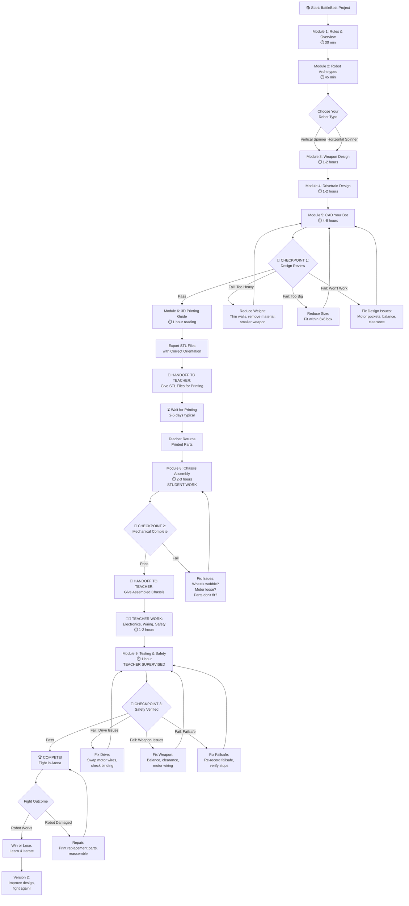

# Student Workflow Diagram

**Purpose:** Visual guide showing the complete student journey from start to competition, including all checkpoints, decision points, and teacher handoffs.

---

## Complete Student Journey



---

## Timeline Overview

### Typical 5-Week Schedule

| Week | Phase | Student Activities | Teacher Activities | Deliverable |
|------|-------|-------------------|-------------------|-------------|
| **Week 1** | Design & Planning | Modules 1-4: Rules, archetypes, weapon physics, drivetrain planning | Answer questions, review concepts | Design concept (paper sketch) |
| **Week 2** | CAD Design | Module 5: CAD entire robot in Onshape | Design review meetings, CAD help | Onshape assembly + STL files |
| **Week 3** | 3D Printing | Module 6: Learn printing principles, wait for parts | Print all student parts | Printed parts ready |
| **Week 4** | Mechanical Assembly | Module 8: Assemble chassis, motors, wheels, weapon | Supervise assembly, troubleshoot | Mechanically complete chassis |
| **Week 5** | Electronics & Testing | Module 9: Learn safety, watch teacher wire, test robot | Wire electronics, safety testing, drive training | Competition-ready robot |

**Total Time Investment:**
- **Student active work:** 13-24 hours
- **Waiting for prints:** 2-5 days
- **Teacher work:** 3-5 hours per student

---

## Decision Points

### Decision 1: Choose Robot Archetype (Module 2)

**Question:** What kind of spinner should I build?

```
First-time builder? → Drum Spinner or Eggbeater
  ↓
  Want maximum hits? → Drum (wide attack area)
  Want maximum damage per hit? → Eggbeater (better bite)

Experienced builder? → Any type
  ↓
  Want spectacular hits? → Large Vertical Disc or Horizontal Spinner
  Want ground control? → Undercutter
```

**Recommendation for beginners:** Drum Spinner
- Most forgiving
- Weapon doubles as armor
- Good ground game potential
- Less affected by recoil

---

### Decision 2: Design Review Pass/Fail (Checkpoint 1)

**Mentor checks:**

| Criteria | Pass | Fail → Fix |
|----------|------|-----------|
| **Weight** | 450-550g in Onshape mass properties | Over 550g → reduce material<br/>Under 400g → add armor |
| **Size** | Fits in 6" x 6" bounding box (top view) | Too big → shrink chassis or weapon |
| **Balance** | Weapon center of mass on spin axis | Off-center → adjust geometry |
| **Feasibility** | Motor pockets correct size, clearances good | Wrong dimensions → fix in CAD |
| **Printability** | No unsupported overhangs, walls thick enough | Can't print → redesign features |

**What happens if you fail:** Iterate in CAD, schedule another review. This is normal and expected.

---

### Decision 3: Mechanical Assembly Pass/Fail (Checkpoint 2)

**Student self-check:**

| System | Check | Pass Criteria |
|--------|-------|--------------|
| **Motors** | Wiggle test | Motors don't move in pockets |
| **Wheels** | Spin test | Wheels spin freely without wobbling |
| **Chassis** | Flex test | Chassis doesn't bend or crack under hand pressure |
| **Weapon** | Clearance test | Hand-spin weapon, 2mm+ gap from all parts |
| **Weight** | Scale test | 450-550g total |

**What happens if you fail:** Fix the issue before handing off to teacher. Ask for help if stuck.

---

### Decision 4: Safety Verification Pass/Fail (Checkpoint 3)

**Teacher checks (student observes):**

| Test | Procedure | Pass Criteria |
|------|-----------|--------------|
| **Drive Test** | Push sticks, robot moves correctly | All 4 directions work (forward, back, left, right) |
| **Weapon Test** | Spin up weapon in sealed arena | Spins smoothly, no vibration, stops cleanly |
| **Failsafe Test** | Turn off transmitter while weapon spinning | Weapon stops immediately, drive motors stop |
| **Battery Test** | Check voltage, inspect for damage | 4.2V per cell, no puffing or damage |

**What happens if you fail:** Teacher helps debug, you re-test. Cannot compete until all tests pass.

---

## Checkpoints Explained

### 🛑 Checkpoint 1: Design Review with Mentor

**When:** After completing CAD (Module 5), before exporting STLs

**Who:** Student brings Onshape link, mentor reviews

**What's Checked:**
1. Robot fits within 6" x 6" footprint (top view in Onshape)
2. Total mass is 450-550g (mass properties in assembly)
3. Weapon is balanced (center of mass on spin axis)
4. Motor pockets are correct dimensions for N20 motors
5. Weapon has 2mm+ clearance from chassis
6. Battery and electronics will fit in allocated space
7. Design is printable (no crazy overhangs, walls thick enough)

**What to Bring:**
- Onshape assembly link (shared with mentor)
- Screenshot of mass properties showing total weight
- Screenshot of top view showing 6x6 bounding box
- List of any questions or concerns

**Possible Outcomes:**
- ✅ **Approved:** Export STLs, move to printing
- ⚠️ **Minor fixes:** Make small changes, quick second review
- ❌ **Major changes needed:** Significant redesign, schedule new review

**Time:** 15-30 minute meeting

---

### 🛑 Checkpoint 2: Mechanical Assembly Complete

**When:** After assembling chassis, motors, wheels, weapon (Module 8), before handing to teacher

**Who:** Student self-checks, then gives to teacher

**What's Checked:**
1. Both N20 drive motors installed securely
2. Wheels attached to motor shafts (D-flat aligned), spin freely
3. Weapon motor mounted (if spinner design)
4. Weapon attached to motor, spins freely with 2mm+ clearance
5. All screws tightened, no loose parts
6. Total weight on scale is 450-550g
7. Photos taken of completed mechanical assembly

**Self-Check Procedure:**
- Wiggle each motor → should not move
- Spin each wheel → smooth, no wobbling
- Press on chassis → rigid, doesn't flex
- Hand-spin weapon → smooth, doesn't touch anything
- Lift and shake robot gently → no rattling parts

**Possible Outcomes:**
- ✅ **Pass:** Hand off to teacher for electronics
- ⚠️ **Minor issues:** Fix and re-check (tight screw, realign wheel)
- ❌ **Major issues:** Disassemble and reassemble properly

**Time:** Final check takes 5-10 minutes

---

### 🛑 Checkpoint 3: Robot Safe and Functional

**When:** After teacher installs electronics and wiring (Module 9), before competition

**Who:** Teacher tests, student observes and learns

**What's Checked:**
1. **Drive test:** Robot drives forward, backward, turns left, turns right correctly
2. **Weapon test:** Weapon spins up smoothly in sealed arena, no excessive vibration
3. **Failsafe test:** Turn off transmitter → weapon and drive STOP immediately
4. **Battery test:** Battery voltage correct (4.2V per cell), no damage
5. **Safety equipment:** Weapon lock works, student knows power-on procedure

**What Student Learns:**
- How to turn on/off safely (transmitter first, then robot)
- How to install/remove weapon lock
- Which stick controls weapon, which controls drive
- What failsafe does and why it's critical

**Possible Outcomes:**
- ✅ **Pass:** Cleared for competition
- ⚠️ **Drive issues:** Swap motor wires, re-test
- ⚠️ **Weapon issues:** Fix balance or clearance, re-test
- ❌ **Failsafe failure:** Re-configure, mandatory re-test

**Time:** 20-30 minutes including teaching

---

## Handoff Points

### 🔄 Handoff 1: STL Files → Teacher

**When:** After design review passes, STLs exported

**What Student Gives Teacher:**
- All STL files (labeled clearly: Chassis.stl, Weapon.stl, Wheel-Left.stl, etc.)
- Print settings notes (if different from defaults)
- Priority (which parts needed first)

**What Student Receives Back:**
- Printed parts (2-5 days typical)
- Any parts that failed to print (need redesign)

**What Happens During Wait:**
- Optional: Start on another project
- Optional: Prepare assembly workspace and tools
- Optional: Watch assembly videos to prepare

---

### 🔄 Handoff 2: Mechanical Chassis → Teacher

**When:** After mechanical assembly complete

**What Student Gives Teacher:**
- Fully assembled chassis (motors, wheels, weapon, armor)
- Battery (if student has one assigned)
- Assembly photos for reference

**What Student Receives Back:**
- Fully wired robot with electronics installed
- Transmitter paired to robot
- Safety briefing

**What Happens During Wait:**
- Watch safety videos
- Read Testing & Safety module (Module 9)
- Prepare repair kit for competition day

---

## What Happens at Competition

### Pre-Fight (15 minutes before match)

1. **Battery check:** Fully charged? (4.2V per cell)
2. **Mechanical check:** All screws tight, weapon spins freely
3. **Safety check:** Weapon lock installed
4. **Weight check:** Robot weighed if required
5. **Driver briefing:** Review controls, strategy

### Fight Sequence (5 minutes total)

1. **Setup:** Robot placed in arena, weapon lock removed, arena sealed
2. **Power-on:** Transmitter ON → Robot ON → Weapon lock removed → Arena closed
3. **Fight:** 2 minutes or until knockout
4. **Power-off:** Stop weapon → Wait for spindown → Arena opened → Weapon lock installed → Robot OFF → Transmitter OFF
5. **Retrieve:** Robot returned to pit area

### Post-Fight (10-30 minutes)

1. **Damage assessment:** What broke? What needs repair?
2. **Repair:** Replace broken parts (print spares if needed)
3. **Re-test:** Verify robot still functions correctly
4. **Prepare for next fight**

---

## Iteration Cycle

After your first competition:

```
Fight → Assess Damage → Identify Improvements → Redesign → Print v2 → Test → Fight Again
```

**Common Improvements:**
- Add armor where you got hit
- Increase weapon mass for harder hits
- Improve ground game (lower wedge angle)
- Upgrade to metal weapon teeth
- Add wheel guards
- Reinforce chassis stress points

**Goal:** Every fight teaches you something. Apply what you learn to Version 2.

---

## Key Takeaways

1. **Total timeline:** 5 weeks from start to competition
2. **Student active work:** 13-24 hours
3. **Critical path:** Design review → Printing → Assembly → Electronics → Safety test
4. **3 major checkpoints:** Design review, mechanical complete, safety verified
5. **2 teacher handoffs:** STLs for printing, chassis for electronics
6. **Iteration is expected:** Damage, repair, improve, fight again

---

**Workflow Guide Complete:** March 13, 2026
