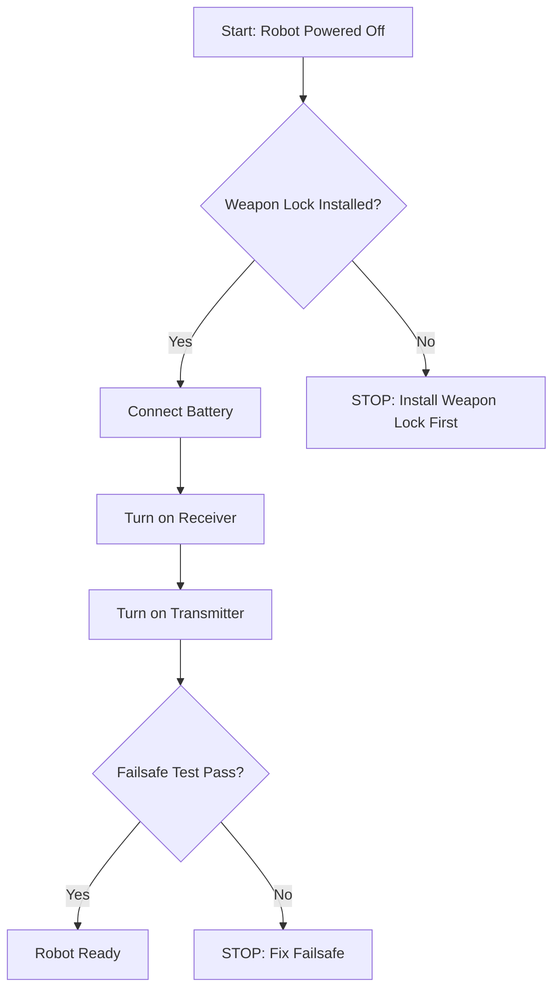

# Visual Asset Standards

**Version:** 1.0
**Last Updated:** March 13, 2026
**Purpose:** Specifications for all images, diagrams, and visual assets in the curriculum

---

## Image Categories & Specifications

### 1. Robot Example Photos

**Purpose:** Show different robot archetypes and real-world examples

**Specifications:**
- **Format:** JPG
- **Max dimensions:** 1200px wide
- **File size:** <300KB
- **Aspect ratio:** 4:3 or 16:9 preferred
- **Resolution:** Sharp, no pixelation
- **Background:** Arena or clean neutral background

**Required elements:**
- Clear view of weapon type
- Full robot visible
- Good lighting (no harsh shadows)

**Optional elements:**
- Action shots showing weapon in motion
- Multiple angles of same robot
- Scale reference (if helpful)

**Naming convention:**
```
archetype-type-descriptor-number.jpg

Examples:
archetype-drum-spinner-wide.jpg
archetype-vertical-disc-compact.jpg
archetype-undercutter-red.jpg
```

**Example alt text:**
```markdown

```

---

### 2. CAD Screenshots

**Purpose:** Guide students through Onshape workflow steps

**Specifications:**
- **Format:** PNG (for UI clarity and text readability)
- **Max dimensions:** 1600px wide
- **File size:** <500KB
- **Resolution:** 2x for Retina displays when possible
- **Zoom level:** Close enough to read dimensions and text

**Required elements:**
- Relevant UI panels visible (Feature tree, Properties)
- Readable text and dimensions
- Proper view angle (isometric for 3D, normal for sketches)
- Feature being explained is clearly visible

**What to include:**
- Feature tree (left panel) if showing feature creation
- Dimension values
- Sketch constraints
- Dialog boxes for commands

**What to crop out:**
- Unnecessary toolbar sections
- Empty space
- Irrelevant browser tabs
- Personal information

**Annotation standards:**
- Use red arrows (3px stroke, solid) to point to specific features
- Use red boxes (3px stroke, no fill) to highlight UI elements
- Use white text with dark outline for labels (14pt minimum)
- Keep annotations minimal and clear

**Naming convention:**
```
cad-feature-description.png

Examples:
cad-chassis-sketch-rectangle.png
cad-extrude-bottom-plate.png
cad-mass-properties-weapon.png
cad-assembly-mate-motor.png
```

**Example:**
```markdown

*Your feature tree should show Sketch 1 and Extrude 1. If you see errors (red X), something went wrong.*
```

---

### 3. Technical Diagrams

**Purpose:** Explain physics, geometry, forces, and concepts visually

**Specifications:**
- **Format:** SVG (vector, preferred) or PNG at 2x resolution
- **Max dimensions:** 1200px wide
- **File size:** <200KB
- **Colors:** Maximum 4 colors per diagram
- **Line weight:** 2-3px for main elements, 1px for guidelines

**Color palette (use these consistently):**
```
Primary (instructional): #2563EB (blue)
Success/correct:         #10B981 (green)
Warning/caution:         #F59E0B (amber)
Danger/incorrect:        #EF4444 (red)
Neutral/reference:       #6B7280 (gray)
Force arrows:            #3B82F6 (blue)
```

**Typography:**
- Font: Sans-serif (Arial, Helvetica)
- Minimum text size: 14pt
- Labels: 12pt minimum
- Dimensions: Gray text (#6B7280)

**Layout rules:**
- Flow direction: Top-to-bottom or left-to-right
- Arrows indicate direction/force/flow
- Use dashed lines for hidden edges or guidelines
- Use solid lines for visible edges
- Highlight critical elements in red or orange

**Required elements:**
- Clear labels with leader lines
- Dimension arrows with values
- Legend if using multiple symbols
- North arrow or orientation indicator (if relevant)

**Naming convention:**
```
diagram-concept-description.svg

Examples:
diagram-weapon-bite-calculation.svg
diagram-force-vectors-impact.svg
diagram-clearance-check.svg
diagram-drivetrain-layout.svg
```

**Example:**
```markdown

*Bite is measured from the tooth tip to the root of the next tooth. For beetleweights, aim for 10-15mm bite depth.*
```

---

### 4. Component Photos

**Purpose:** Show physical hardware (motors, electronics, fasteners)

**Specifications:**
- **Format:** JPG
- **Max dimensions:** 800px wide
- **File size:** <200KB
- **Background:** White or neutral (no distractions)
- **Lighting:** Soft, even (no harsh shadows)
- **Focus:** Sharp detail on important features

**Required elements:**
- Component fills frame (crop tight)
- Important features visible (shaft, mounting holes, connectors)
- Good depth of field (all critical parts in focus)
- Scale reference if size is important (ruler, coin)

**Optional elements:**
- Multiple angles in separate images
- Detail shots of specific features
- Comparison shots (before/after, correct/incorrect)

**Naming convention:**
```
component-name-variant.jpg

Examples:
motor-n20-300rpm-d-shaft.jpg
battery-lipo-2s-300mah.jpg
screw-m3-8mm-button-head.jpg
wheel-40mm-tpu.jpg
```

**Example:**
```markdown

*The D-shaft has one flat side that prevents the wheel from spinning freely. This flat must align with the wheel hub.*
```

---

### 5. Assembly Photos

**Purpose:** Demonstrate build steps and techniques

**Specifications:**
- **Format:** JPG
- **Max dimensions:** 1200px wide
- **File size:** <300KB
- **Angle:** Clear view of the assembly step
- **Lighting:** Consistent across photo series
- **Hands:** Visible performing the action (when helpful)

**Required elements:**
- Assembly step clearly visible
- Parts properly positioned
- In-focus critical details
- Enough context to understand orientation

**For photo series:**
- Same lighting setup for all photos
- Same background
- Same camera angle/distance
- Numbered or sequenced logically

**What to include:**
- Hands showing technique (how to hold, how much pressure)
- Tools being used correctly
- Orientation markers (front, top, etc.)

**What to avoid:**
- Blurry images
- Dark shadows obscuring details
- Cluttered background
- Fingers blocking critical view

**Naming convention:**
```
assembly-action-description-step.jpg

Examples:
assembly-motor-press-fit-01.jpg
assembly-motor-press-fit-02.jpg
assembly-wire-routing.jpg
assembly-wheel-installation.jpg
```

**Example:**
```markdown

*Press the motor straight down into the pocket. Apply firm pressure but don't force it — if it won't go in, check the pocket dimensions.*
```

---

### 6. Process Diagrams / Flowcharts

**Purpose:** Show decision trees, procedures, workflows

**Specifications:**
- **Format:** SVG (Mermaid markdown) or PNG
- **Max dimensions:** 1000px wide
- **File size:** <150KB
- **Layout:** Top-to-bottom flow preferred
- **Node style:** Rounded rectangles for steps, diamonds for decisions

**Typography:**
- Font: Sans-serif
- Node text: 12-14pt
- Arrow labels: 10-12pt

**Color scheme:**
- Start/End: Green (#10B981)
- Process: Blue (#2563EB)
- Decision: Amber (#F59E0B)
- Error/Stop: Red (#EF4444)

**Layout rules:**
- Consistent spacing between nodes
- Arrow direction clearly indicated
- Decision branches labeled (Yes/No, Pass/Fail)
- No crossing arrows if possible

**Naming convention:**
```
flowchart-procedure-name.svg

Examples:
flowchart-power-on-sequence.svg
flowchart-troubleshoot-motor.svg
flowchart-weapon-safety-check.svg
```

**Example using Mermaid:**
```markdown

```

---

## Image Optimization

### Before Adding Any Image

1. **Resize to maximum dimensions** (don't exceed specs above)
2. **Compress appropriately** (use TinyPNG, ImageOptim, or similar)
3. **Verify file size** meets category limit
4. **Test loading** in local MkDocs build
5. **Check mobile rendering** (responsive sizing)

### Optimization Tools

**For JPG (photos):**
- TinyPNG (online): https://tinypng.com
- ImageOptim (Mac): https://imageoptim.com
- Command line: `mogrify -resize 1200x -quality 85 image.jpg`

**For PNG (screenshots):**
- TinyPNG (online): https://tinypng.com
- pngquant (command line): `pngquant --quality=65-80 image.png`
- ImageOptim (Mac): https://imageoptim.com

**For SVG (diagrams):**
- SVGO (command line): `svgo image.svg`
- SVGOMG (online): https://jakearchibald.github.io/svgomg/

### Quality vs. Size Trade-offs

**JPG Quality Settings:**
- 85-90%: High quality, good for hero images (larger file size)
- 80-85%: Good quality, standard for most photos
- 70-80%: Acceptable quality, use when file size matters

**When to use each:**
- Robot example photos: 85% quality
- Assembly photos: 80% quality
- Component photos: 85% quality (detail matters)
- Background/decorative: 75% quality

---

## Directory Structure

```
images/
├── archetypes/      # Robot type examples (drum, disc, undercutter, etc.)
├── assembly/        # Build process photos (press-fit, wiring, etc.)
├── cad/             # Onshape screenshots (feature tree, mass props, etc.)
├── components/      # Hardware close-ups (motors, batteries, screws)
├── diagrams/        # Technical diagrams (physics, forces, geometry)
├── printing/        # 3D printing (orientation, settings, troubleshooting)
├── safety/          # Safety procedures (weapon lock, arena setup)
├── weapons/         # Weapon-specific photos and diagrams
├── attribution.md   # Complete attribution for all CC-licensed content
└── README.md        # Image directory guide
```

**Rules:**
- Never place images directly in root `/images/`
- Create new subdirectory if existing categories don't fit
- Keep subdirectories focused on one topic
- Use plural names for directories (`archetypes`, not `archetype`)

---

## File Naming Standards

### Format

```
category-descriptive-name.extension
```

**Rules:**
1. All lowercase letters
2. Hyphens only (no underscores, spaces, or special characters)
3. Descriptive (action + subject or subject + detail)
4. No timestamps or version numbers in filename
5. Extension indicates file type (`.jpg`, `.png`, `.svg`)

### Examples

**Good:**
```
motor-n20-shaft-detail.jpg
assembly-frame-build-step-1.jpg
diagram-bite-calculation.svg
cad-mass-properties-weapon.png
archetype-drum-spinner-front.jpg
```

**Bad:**
```
IMG_1234.jpg                    (not descriptive)
photo_march_12.jpg              (underscores, timestamp)
OnshapeScreenshot.png           (capitals)
weapon.jpg                      (too generic)
chassis-v2-final-FINAL.stl      (version numbers, capitals)
my robot photo.jpg              (spaces)
```

---

## Alt Text Standards

### Purpose

Alt text provides:
- Accessibility for screen readers
- Context when images fail to load
- SEO benefits
- Text description for text-only browsers

### Requirements

**Length:** 15-25 words optimal (125 characters maximum)
**Content:** Describe what's shown, not just name objects
**Detail:** Include technical details relevant to learning
**No redundancy:** Don't repeat caption content verbatim

### Formula

```
[Action/process] showing [subject] with [critical details visible]
```

### Examples

**Good:**
```markdown

```

**Too generic:**
```markdown

```

**Too long:**
```markdown

```

**Good:**
```markdown

```

**Too technical:**
```markdown

```

### Alt Text by Image Type

**Robot photos:**
Format: `[Robot type] showing [key features]`
```markdown

```

**CAD screenshots:**
Format: `[Software view] showing [feature/tool] with [relevant UI elements]`
```markdown

```

**Technical diagrams:**
Format: `Diagram showing [concept] with [labeled elements]`
```markdown

```

**Component photos:**
Format: `[Component name] showing [critical features]`
```markdown

```

**Assembly photos:**
Format: `[Action] showing [technique/position] with [critical detail]`
```markdown

```

---

## Caption Standards

### Purpose

Captions provide:
- Learning context ("what to observe")
- Troubleshooting hints ("if you see X, check Y")
- Comparison to student's work
- Attribution for third-party content

### Guidelines

**Length:** 1-2 sentences
**Focus:** Explain what to learn or observe
**Style:** Active, direct, helpful
**Format:** Italic text below image

### What Makes a Good Caption

**Good captions:**
- Point out critical details
- Explain what's correct or incorrect
- Connect to student's current task
- Provide troubleshooting context

**Bad captions:**
- Just repeat alt text
- State the obvious
- Too generic to be helpful
- No actionable information

### Examples

**Good:**
```markdown

*The flat side of the D-shaft must align with the flat side of the wheel hub. If misaligned, the wheel will slip during driving.*
```

**Too generic:**
```markdown

*This is an N20 motor with a D-shaft.*
```

**Good:**
```markdown

*Horizontal holes (red) concentrate stress at layer lines and fail easily. Vertical holes (green) distribute forces across solid layers and are much stronger. Always orient your chassis with holes vertical.*
```

**Good with attribution:**
```markdown

*Drum spinner demonstrates wide attack area and frontal armor protection. The cylindrical weapon is difficult to avoid in the arena. Photo by AlexKorvin, CC BY-SA 4.0.*
```

---

## Accessibility Requirements

### WCAG AA Compliance

**Color Contrast:**
- Text on diagrams: 4.5:1 minimum contrast ratio
- UI elements: 3:1 minimum contrast ratio
- Test using WebAIM Contrast Checker: https://webaim.org/resources/contrastchecker/

**Information Encoding:**
- Never use color alone to convey information
- Use shapes, patterns, and labels in addition to color
- Example: Don't just use red/green — use "Red X (incorrect)" vs "Green check (correct)"

**Text Alternatives:**
- All images must have descriptive alt text
- Complex diagrams should have text description in content
- Charts/graphs need data tables or text summary
- Video/GIF content must have text description of action

### Color-Blind Safe Palettes

**Use these combinations for maximum accessibility:**

**Red-green safe:**
- Blue (#2563EB) and Orange (#F97316)
- Purple (#7C3AED) and Yellow (#F59E0B)

**Avoid relying on:**
- Red vs. Green alone (8% of males are red-green colorblind)
- Blue vs. Purple alone
- Subtle color differences

**Best practice:**
Use color + shape + label:
- ✅ Red circle with X + label "Incorrect"
- ✅ Green square with checkmark + label "Correct"

### Testing for Accessibility

**Tools:**
- Chrome DevTools Lighthouse (Accessibility audit)
- WAVE Browser Extension: https://wave.webaim.org/extension/
- Color Oracle (colorblind simulator): https://colororacle.org/

**Manual checks:**
- View diagrams in grayscale (remove color)
- Test with screen reader (VoiceOver on Mac, NVDA on Windows)
- Zoom to 200% (everything still readable?)

---

## Attribution & Licensing

### When Attribution is Required

**Creative Commons licensed images:**
- CC BY (Attribution)
- CC BY-SA (Attribution-ShareAlike)
- CC BY-NC (Attribution-NonCommercial)
- CC BY-NC-SA (Attribution-NonCommercial-ShareAlike)

**What to include:**
1. Author/creator name
2. License type with link
3. Link to original source
4. "No changes" or "Cropped/annotated" if modified

### Attribution Format

**In caption (preferred for single images):**
```markdown

*Caption content. Photo by [Author Name], [License] [(link)](url)*
```

**Example:**
```markdown

*Wide attack area makes drum spinners effective. Photo by AlexKorvin, [CC BY-SA 4.0](https://creativecommons.org/licenses/by-sa/4.0/)*
```

**In module footer (for multiple images):**
```markdown
---

## Image Credits

- **Drum spinner example:** AlexKorvin, [CC BY-SA 4.0](url)
- **Vertical disc example:** TeamXYZ, [CC BY 2.0](url)

Full attribution details in [images/attribution.md](../images/attribution.md).
```

**In central attribution.md file:**
```markdown
## images/archetypes/drum-spinner.jpg

- **Source:** Wikimedia Commons
- **Author:** AlexKorvin
- **License:** CC BY-SA 4.0
- **Original URL:** https://commons.wikimedia.org/wiki/File:drum-spinner.jpg
- **Changes:** Cropped to square, compressed to 300KB
- **Downloaded:** 2026-03-12
```

### Original CTRC Content

For images created by CTRC team:

**In caption:**
```markdown
*Original diagram by CTRC, 2026.*
```

**No additional license needed** — CTRC retains copyright but provides for educational use.

---

## Integration Checklist

Before adding any image to the curriculum:

**Sourcing:**
- [ ] Image is CC-licensed, public domain, or CTRC original
- [ ] License allows educational use and modifications (if needed)
- [ ] Source and license documented in attribution.md

**Quality:**
- [ ] Image meets category specifications (format, size, resolution)
- [ ] File size optimized (under category limit)
- [ ] Image is sharp and well-lit
- [ ] Critical details are visible and in focus

**Accessibility:**
- [ ] Descriptive alt text provided (15-25 words)
- [ ] Caption explains what to learn or observe
- [ ] Color contrast meets WCAG AA standards (if diagram)
- [ ] Information not conveyed by color alone

**Technical:**
- [ ] File named correctly (lowercase, hyphens, descriptive)
- [ ] Placed in correct subdirectory
- [ ] Relative path used in markdown
- [ ] Loads correctly in local build

**Attribution (if required):**
- [ ] Author name included
- [ ] License type specified
- [ ] Link to original source
- [ ] Documented in attribution.md

---

## Quality Assurance

### Pre-Publication Checks

**Run these checks before committing images:**

1. **File size check:**
```bash
ls -lh images/**/*.jpg images/**/*.png | awk '{if ($5 > 500000) print $0}'
```

2. **Naming convention check:**
```bash
# Look for files with spaces, capitals, or underscores
find images/ -name "* *" -o -name "*[A-Z]*" -o -name "*_*"
```

3. **Alt text check:**
```bash
# Grep for images without alt text (manual review needed)
grep -n "!\[\](" *.md
```

4. **Broken image check:**
```bash
# Run MkDocs build and check for warnings
mkdocs build --strict
```

5. **Attribution check:**
```bash
# List all JPG/PNG files and verify attribution.md has entries
ls images/**/*.{jpg,png} > /tmp/images.txt
# Manually compare with attribution.md
```

---

**Visual Standards Version:** 1.0
**Last Updated:** March 13, 2026
**Next Review:** Before 2027 competition season

This document is a living standard. Suggest improvements by opening an issue or submitting a pull request.
