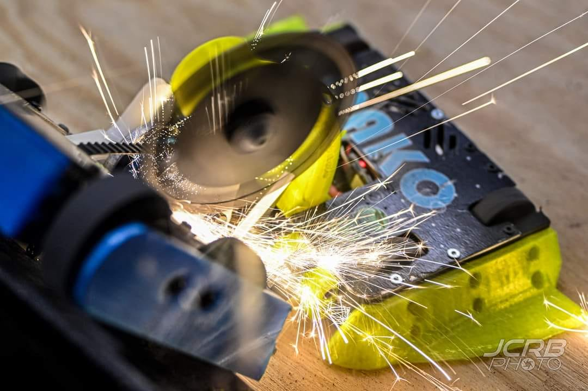
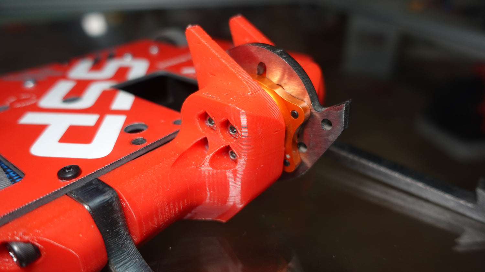
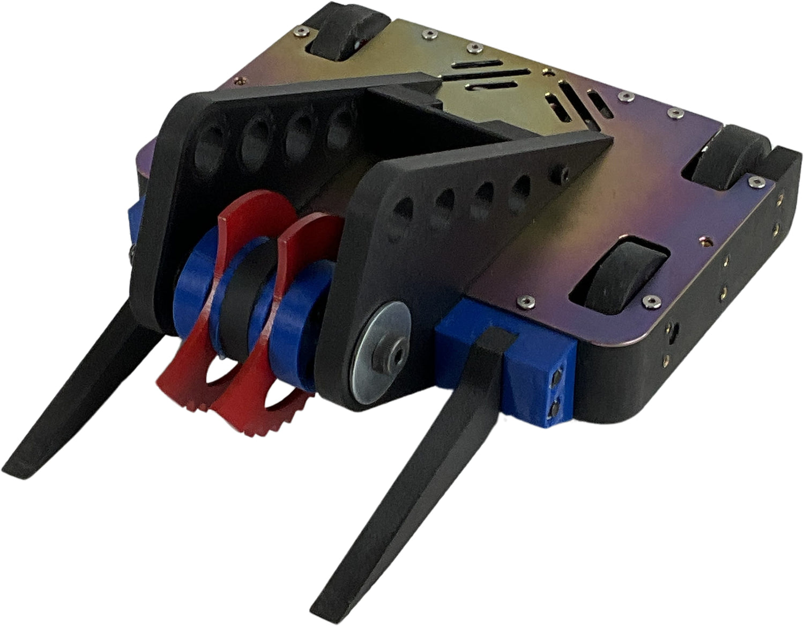

# Chassis Assembly

You have your printed parts, motors, and hardware. Now it's time to put the mechanical chassis together. This guide walks you through the assembly process step by step.

!!! note "Electronics & Wiring"
    Your teacher will handle all electronics, wiring, and safety setup. This module focuses only on mechanical assembly - screws, motors, wheels, and chassis structure.

Take your time. A robot assembled carefully fights better than one thrown together in a rush.

---

## Video Walkthrough: Complete Beetleweight Assembly

Before you start, watch this complete assembly video to understand the full process:

  <iframe src="https://www.youtube.com/embed/LtPvlPN9Mmg" style="position: absolute; top: 0; left: 0; width: 100%; height: 100%;" frameborder="0" allowfullscreen></iframe>

**SSP 2.0 Kit Assembly Guide** by Just 'Cuz Robotics (1:10:14) - Posted July 2025

This video shows a complete 3D-printed beetleweight assembly from start to finish. Even if you're not using the SSP kit, the techniques (motor installation, wheel mounting, weapon assembly) apply to all beetleweight builds with N20 or similar drive motors.

**Key Assembly Timestamps:**
- [21:46](https://youtu.be/LtPvlPN9Mmg?t=1306) - Drive wheel installation
- [25:38](https://youtu.be/LtPvlPN9Mmg?t=1538) - Drive motor mounting
- [12:22](https://youtu.be/LtPvlPN9Mmg?t=742) - Weapon arm assembly
- [33:46](https://youtu.be/LtPvlPN9Mmg?t=2026) - Front attachment installation
- [37:02](https://youtu.be/LtPvlPN9Mmg?t=2222) - Chassis final assembly

Written assembly guide (backup reference): [SSP 2.0 Assembly Guide - Google Docs](https://docs.google.com/document/d/166_mALVRaIq55Ffp6hWE1syFC-ohi_EdmoM3bOuxBZE/edit)

---

## Learning Objectives

By completing this module, you will be able to:

- Install N20 motors in chassis pockets using press-fit or glue
- Attach wheels to motor D-shafts with proper alignment
- Assemble multi-piece chassis with screws and proper tightening sequence
- Mount weapon motors and install spinning weapons with clearance checks
- Verify completed chassis weight and identify areas to add/remove mass
- Prepare robot for teacher handoff (electronics installation)

---

## Time Required

2-3 hours

---

## Before You Start

Gather everything on a clean, well-lit workspace:

### Parts Checklist

| Component | Quantity | Status |
|-----------|----------|--------|
| 3D printed chassis | 1 | Cleaned, supports removed |
| 3D printed weapon (blade/drum) | 1 | Balanced, verified |
| 3D printed wheels | 2 | Hub fits motor shaft |
| 3D printed weapon hub (TPU) | 1 | Fits weapon motor shaft |
| 3D printed armor panels (if applicable) | As designed | |
| N20 3V 300RPM motors | 2 | Tested, working |
| Brushless weapon motor | 1 | Tested, working |
| Screws / fasteners | As designed | M2, M3, or designed size |
| CA glue (super glue) | 1 bottle | For securing motors |
| Velcro strips (optional) | As needed | For removable panels |

### Tools Needed

- Small Phillips and hex screwdrivers
- CA glue (super glue)
- Fine sandpaper (if motor fit needs adjustment)
- Scale (for final weight check)

---

## Step 1: Install N20 Drive Motors

**Watch: Drive Motor Installation (25:38-28:27)**

  <iframe src="https://www.youtube.com/embed/LtPvlPN9Mmg?start=1538&end=1707" style="position: absolute; top: 0; left: 0; width: 100%; height: 100%;" frameborder="0" allowfullscreen></iframe>

*SSP 2.0 Assembly - Drive motor mounting demonstration*

**Your Steps:**

1. Take your chassis and identify the left and right motor pockets
2. Orient each N20 motor so the shaft exits through the chassis wall toward the wheel position
3. **Press-fit** the motor into the pocket — it should be snug but not forced
4. If the fit is too loose, add a thin wrap of tape around the motor body or a drop of CA glue
5. If the fit is too tight, lightly sand the pocket with fine sandpaper
6. Verify: the motor shaft spins freely and extends past the chassis wall

!!! warning "Don't Force It"
    If the motor won't go in, do NOT hammer it or use pliers. You'll damage the internal gears. Sand the pocket wider or reprint with 0.1mm more tolerance.

---

## Step 2: Attach Wheels

**Watch: Wheel Installation (17:46-21:46)**

  <iframe src="https://www.youtube.com/embed/LtPvlPN9Mmg?start=1066&end=1306" style="position: absolute; top: 0; left: 0; width: 100%; height: 100%;" frameborder="0" allowfullscreen></iframe>

*SSP 2.0 Assembly - Front wheel attachment and rear wheel installation on motor shafts*

**Your Steps:**

1. Slide each wheel onto the N20 motor D-shaft
2. The D-flat on the shaft should align with the D-flat in the wheel hub
3. Push the wheel on until it's seated against the chassis wall (leave ~0.5mm gap to avoid rubbing)
4. If using a set screw, tighten it gently against the flat of the D-shaft
5. Test: spin each wheel by hand — it should spin freely without wobbling

!!! tip "D-Shaft Alignment"
    The D-flat on the motor shaft must line up with the D-flat in the wheel hub. If it doesn't align, the wheel will slip when the motor spins.

### If the Wheel Slips on the Shaft

- Add a drop of CA glue between the shaft and hub (let it set fully before testing)
- Or wrap a small piece of tape around the shaft before pressing the wheel on
- Or re-print the wheel with a tighter hub hole (reduce by 0.1mm)

---

## Step 3: Assemble Chassis Frame

**Watch: Chassis Assembly (37:02-39:38)**

  <iframe src="https://www.youtube.com/embed/LtPvlPN9Mmg?start=2222&end=2378" style="position: absolute; top: 0; left: 0; width: 100%; height: 100%;" frameborder="0" allowfullscreen></iframe>

*SSP 2.0 Assembly - Lid installation and chassis final assembly*

Now that motors and wheels are installed, it's time to close up the chassis.

**Your Steps:**

1. **If your design has multiple chassis pieces** (top plate, bottom plate, side panels):
   - Align all screw holes
   - Insert screws and tighten gradually (don't fully tighten one screw before starting the others)
   - Work in a cross pattern to distribute pressure evenly

2. **If your design is a single-piece chassis:**
   - Skip to armor installation below

3. **Check alignment:**
   - Wheels should spin freely without rubbing
   - Motors should be secure and not wobbling
   - No parts should be cracked or stressed

---

## Step 4: Add Armor (If Applicable)

If your design includes armor panels or bumpers, install them now.

!!! note "Modern 3D-Printed Armor"
    Most modern beetleweights use **TPU (flexible filament)** for armor instead of UHMW plastic sheets. TPU absorbs impacts and can be printed directly into your design. Check the SSP assembly video to see examples of TPU armor integration.

**Your Steps:**

1. Position armor panels according to your CAD design
2. Secure with screws, CA glue, or velcro (depending on design)
3. Armor should cover vulnerable areas: wheels, electronics space, battery

---

## Step 5: Mount the Weapon Motor (Teacher Assisted)

1. Position the weapon motor in its mount at the front of the chassis
2. Secure using screws through the motor's mounting holes into the chassis (or printed clamp)
3. Verify the motor shaft is accessible and clear of obstructions
4. The motor should be firmly mounted — it will experience significant forces during weapon impacts

!!! tip "Thread-Locking"
    Weapon motor mounting screws can vibrate loose during fights. If you have thread-locking compound (blue Loctite), use a small amount on the screws. Alternatively, add a drop of CA glue to each screw head after tightening.

---

## Step 6: Install Weapon (For Spinner Designs)

!!! warning "Teacher Supervised"
    Weapon installation should be done with teacher supervision for safety.

**Watch: Weapon Assembly (12:22-17:46)**

  <iframe src="https://www.youtube.com/embed/LtPvlPN9Mmg?start=742&end=1066" style="position: absolute; top: 0; left: 0; width: 100%; height: 100%;" frameborder="0" allowfullscreen></iframe>

*SSP 2.0 Assembly - Lifting arm assembly showing weapon mounting techniques*

If your robot has an active weapon (spinner, hammer, lifter):

**Your Steps:**

1. Mount weapon motor securely to chassis (teacher will assist)
2. Attach TPU weapon hub to motor shaft
3. Secure weapon to hub
4. Add shaft collars or retention hardware
5. **Check clearance:** Spin weapon by hand - minimum 2mm clearance from all parts

### For Wedge/Pusher Designs

**Watch: Front Attachment Installation (33:46-37:02)**

  <iframe src="https://www.youtube.com/embed/LtPvlPN9Mmg?start=2026&end=2222" style="position: absolute; top: 0; left: 0; width: 100%; height: 100%;" frameborder="0" allowfullscreen></iframe>

*SSP 2.0 Assembly - Front fork installation (similar technique for wedges)*

If you're building a wedge bot:
1. Attach front wedge plate according to CAD design
2. Ensure wedge is rigid and won't flex during pushing matches
3. Angle should be low enough to get under opponents

---

## Step 7: Final Weight Check (Mechanical Assembly Complete)

**Put your completed robot on a scale.**

| Result | Action |
|--------|--------|
| Under 450g | Consider adding armor or increasing weapon mass |
| 450-520g | You're in the sweet spot |
| 520-550g | Acceptable for in-house, but look for easy weight savings |
| Over 550g | You need to remove material — thinner walls, less infill on reprinted parts, or remove non-essential features |

---

## Assembly Tips

!!! tip "Take Photos at Each Step"
    Photograph your robot at every stage of assembly — motors installed, wiring completed, weapon mounted, closed up. When something breaks in the arena (and it will), these photos are your assembly manual for rapid repair.

!!! tip "Label Everything"
    Mark "L" and "R" on your motors, wheels, and wire pairs. Write "TOP" on your chassis. Label the battery positive wire. When you're frantically repairing between matches, labels save minutes.

!!! tip "Build a Repair Kit"
    For competition day, pack: spare N20 motors, spare weapon, spare wheels, CA glue, zip ties, electrical tape, soldering iron, solder, wire, screwdrivers, and your assembly photos. You will need at least some of these.

---

## Assembly Checklist (Mechanical Only)

- [ ] N20 drive motors installed (left and right)
- [ ] Wheels attached and spinning freely
- [ ] Chassis frame assembled (all screws tightened)
- [ ] Armor panels attached (if applicable)
- [ ] Weapon motor mounted (if applicable)
- [ ] Weapon spinning freely with 2mm+ clearance
- [ ] Total weight checked (~500g target)
- [ ] Photos taken of completed chassis assembly

---

## Success Criteria

You are ready to move on when you can:

- [ ] Complete the Assembly Checklist above (all items checked)
- [ ] Demonstrate that both drive motors spin freely when wheels are turned by hand
- [ ] Show that weapon spins freely with 2mm+ clearance from all chassis parts
- [ ] Verify total mechanical weight is 450-520g (or explain why it's different)
- [ ] Identify which components are removable for repairs (wheels, weapon, armor)
- [ ] Hand off completed mechanical chassis to teacher with assembly photos

---

## Modern Build Examples (2024-2025)

Here are examples of modern 3D-printed beetleweights competing at NHRL and local events:

  

    
    
<strong>Mako</strong> - Rank 1 NHRL beetle (2023+), started as SSP kit with custom overhead saw weapon

  

  

    
    
<strong>Shameless Self Promotion</strong> - Original SSP kit upgraded with brushless drive and vertical spinner addon

  

  

    
    
<strong>Ti Die</strong> - Custom SSP build with anodized titanium lid and vertical spinner weapon

  

**More Modern Designs:**

- **[Derivative - Hubmotor Drum Spinner](https://youtu.be/derivative-video-id)** - Modern 2025 beetleweight design by Just 'Cuz Robotics (Nov 2025)
- **[Proof of Concept Robot](https://makerworld.com/en/models/153103)** - Competition-tested 3D-printed design with free downloadable files (Jan 2024)
- **[SSP Mod Gallery](https://justcuzrobotics.com/pages/ssp-mod-gallery)** - 220+ builders have customized SSP kits - see what's possible!
- **[Bristol Bot Builders Gallery](https://bristolbotbuilders.com/guides/)** - UK beetleweight community builds and guides
- **[NHRL Robot Wiki](https://wiki.nhrl.io/)** - Profiles of competing beetleweights with technical details

---

## Video & Resource Attribution

**Assembly videos and photos courtesy of:**
- Just 'Cuz Robotics ([YouTube Channel](https://www.youtube.com/@JustCuzRobotics))
- SSP 2.0 Kit Assembly Guide video (July 2025)
- Beetleweight build photos from [SSP Mod Gallery](https://justcuzrobotics.com/pages/ssp-mod-gallery)
- Educational use with attribution - all rights belong to original creators

**Additional resources:**
- [SSP 2.0 Written Assembly Guide](https://docs.google.com/document/d/166_mALVRaIq55Ffp6hWE1syFC-ohi_EdmoM3bOuxBZE/edit) - Google Docs backup reference
- [Just 'Cuz Robotics Store](https://justcuzrobotics.com/) - SSP kits and combat robot parts
- [Bristol Bot Builders](https://bristolbotbuilders.com/guides/) - Community build guides

All videos and images used for educational purposes under fair use. Students should visit [justcuzrobotics.com](https://justcuzrobotics.com) to support the creators and explore their full product line.

---

## Next Step

Your mechanical chassis is complete! Give it to your teacher for electronics installation, wiring, and safety testing. Once electronics are installed, you'll be ready to test and compete!
