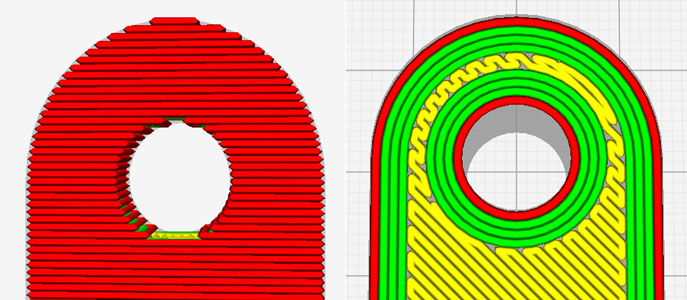
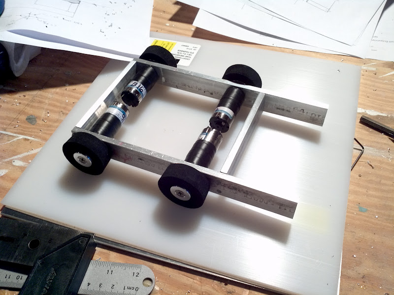
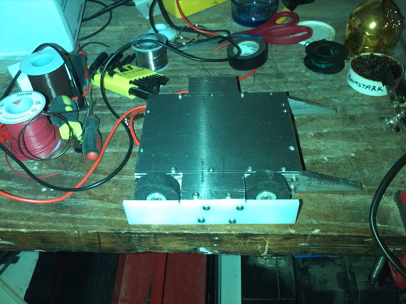
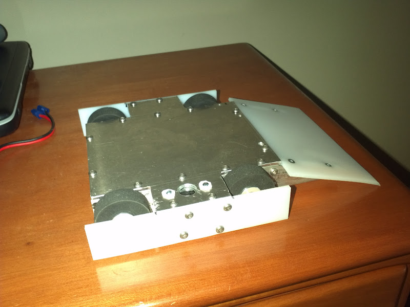
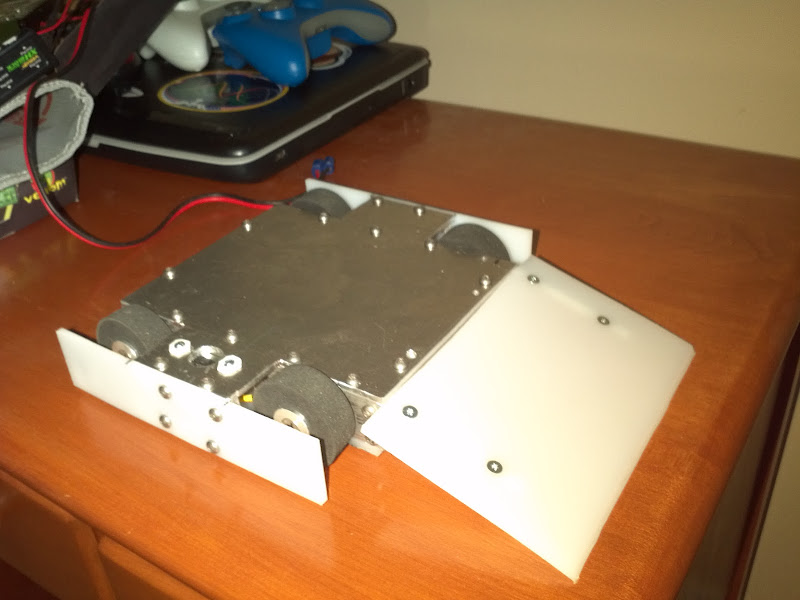
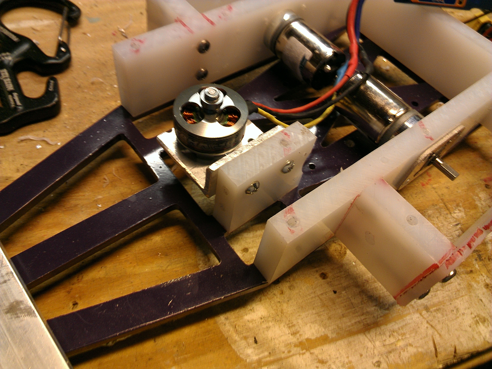
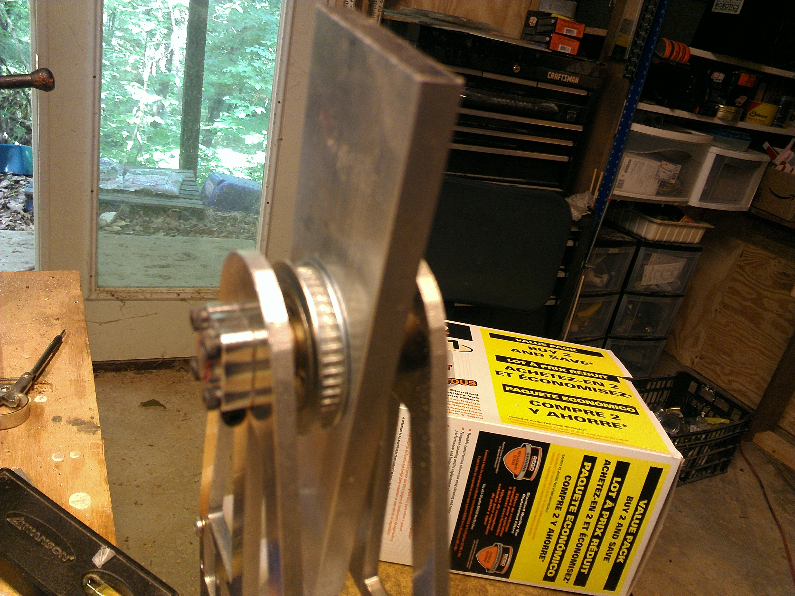
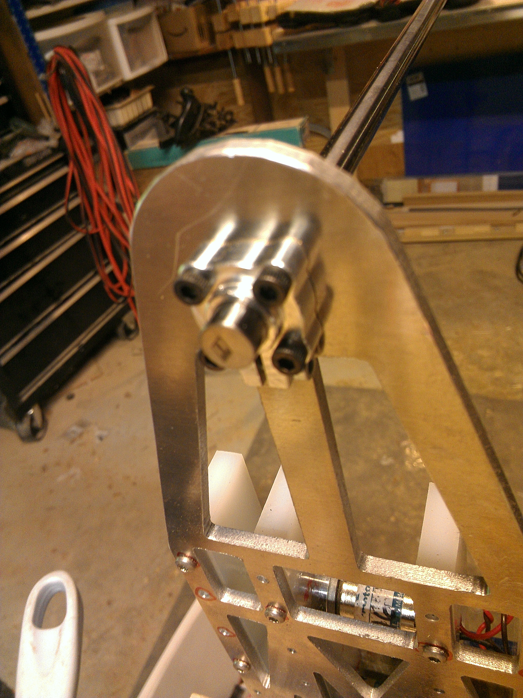

# Image Integration Guide for BattleBots Curriculum

## Overview
This guide maps downloaded images to specific modules in the BattleBots curriculum markdown files.

## Module 6: 3D Printing

### Print Orientation Section

**Image to use:** `printing/hole-orientation-comparison.jpg`

**Suggested markdown placement:**
```markdown
### Understanding Layer Orientation

When 3D printing parts for your BattleBot, the orientation of the part on the print bed significantly impacts its structural strength.



**Key Principle:** Orient parts so the direction that needs to be strongest lies horizontal during printing.

**Why this matters:**
- Horizontally-printed holes create weak points where layer lines concentrate stress
- Vertically-printed holes have solid lines of plastic surrounding them, distributing forces evenly
- This is especially critical for weapon axles, motor mounts, and other stress-bearing features

**Practical example:** If printing a motor mount with mounting holes, orient the part so the holes run vertically through the print layers rather than horizontally across them.
```

**Content source:** Servo Magazine article on maximizing strength

## Module 8: Assembly

### Mechanical Assembly Walkthrough

The following images demonstrate real BattleBot assembly steps. Use these to illustrate mechanical construction techniques.

#### Frame Construction

**Image:** `assembly/frame-assembly.jpg`

**Suggested usage:**
```markdown
### Building the Frame

The frame is the skeleton of your robot. It holds all components together and must be rigid.



**What you see:** Aluminum box structure being assembled with drilled and tapped holes for fastening.

**Your task:** Follow your CAD design to assemble your 3D printed chassis pieces.
```

#### Motor Mounting

**Image:** `assembly/motor-mounts-shaping.jpg`

**Suggested usage:**
```markdown
### Installing Motors

Motors must be securely mounted to transfer power effectively.


**What you see:** Motor mount being shaped to fit the motor's faceplate profile.

**Your approach:** Press-fit or screw your motors into the chassis mounts designed in CAD.
```

#### Armor and Protection

**Image:** `assembly/armor-plates-cutting.jpg`

**Suggested usage:**
```markdown
### Adding Armor

Armor protects your robot's internal components from opponent weapons.



**What you see:** Cutting protective armor from plastic and metal sheets.

**Materials:** Use UHMW plastic or thin aluminum depending on your design.
```

#### Side Protection

**Image:** `assembly/side-bumpers-assembly.jpg`

**Suggested usage:**
```markdown
### Side Bumpers and Guards



**What you see:** UHMW side bumpers being attached to armor plates with fasteners.

**Purpose:** Protects wheels and prevents opponents from getting underneath.
```

#### Weapon Installation (if applicable)

**Image:** `assembly/wedge-installation.jpg`

**Suggested usage:**
```markdown
### Installing Your Wedge

For wedge-style bots, the wedge is your primary defensive weapon.



**What you see:** UHMW wedge plate being installed as the front defensive element.
```

### Advanced: Active Weapon Assembly (Optional Section)

**Note:** These images show horizontal spinner assembly - use only if students are building active weapons.

#### Weapon Motor Mounting

**Image:** `assembly/weapon-motor-mount.jpg`

**Suggested usage:**
```markdown
### Weapon Motor Installation (Advanced)



**What you see:** Brushless motor mounted for weapon drive.

**Caution:** Active weapons require additional safety considerations and testing protocols.
```

#### Weapon Bar Assembly

**Image:** `assembly/weapon-blade-assembly.jpg`

**Suggested usage:**
```markdown
### Fabricating the Weapon Bar



**What you see:** Aluminum weapon bar being prepared and balanced.

**Safety:** Weapon must be balanced and securely fastened to prevent catastrophic failure.
```

#### Shaft Collars

**Image:** `assembly/shaft-collars-installation.jpg`

**Suggested usage:**
```markdown
### Securing Rotating Components



**What you see:** Shaft collars being installed to secure weapon on the axle.

**Purpose:** Prevents lateral movement of rotating components.
```

## File Organization Summary

### Printing Directory (`images/printing/`)
- `hole-orientation-comparison.jpg` - Layer orientation diagram (Module 6)

### Assembly Directory (`images/assembly/`)
- `frame-assembly.jpg` - Frame construction (Module 8)
- `motor-mounts-shaping.jpg` - Motor mounting (Module 8)
- `armor-plates-cutting.jpg` - Armor installation (Module 8)
- `side-bumpers-assembly.jpg` - Side protection (Module 8)
- `wedge-installation.jpg` - Wedge assembly (Module 8)
- `weapon-motor-mount.jpg` - Weapon motor (Module 8 - Advanced)
- `weapon-blade-assembly.jpg` - Weapon bar (Module 8 - Advanced)
- `shaft-collars-installation.jpg` - Shaft collars (Module 8 - Advanced)

## Implementation Notes

### Required for All Students
- Print orientation diagram (Module 6)
- Frame assembly photo (Module 8)
- Motor mounting photo (Module 8)
- Armor installation photo (Module 8)

### Optional/Advanced
- Active weapon assembly photos (only if students build spinners/hammers)
- Keep these separate or in an "Advanced Assembly" section

### What's Intentionally Excluded
- Wiring photos (teacher handles this)
- Electronics assembly (teacher handles this)
- ESC connections (teacher handles this)
- Battery installation (teacher responsibility)

## Gaps Identified

### Still Needed (future search)
1. **Wheel mounting on D-shaft** - Need close-up photo showing wheel attachment to motor D-shaft
2. **Press-fit motor installation** - Close-up of motor being pressed into 3D printed chassis
3. **Layer direction on actual 3D printed part** - Photo showing visible layer lines on a printed chassis piece
4. **Correct vs incorrect print orientation** - Side-by-side comparison of same part printed two ways showing strength difference

### Alternative Approach
Consider taking these photos during first student build session:
- Document student assembly process
- Capture wheel mounting step
- Show layer lines on printed parts
- Demonstrate motor press-fit technique

## Attribution
All sources documented in `attribution.md` in the same directory.

---
Last updated: March 12, 2026
